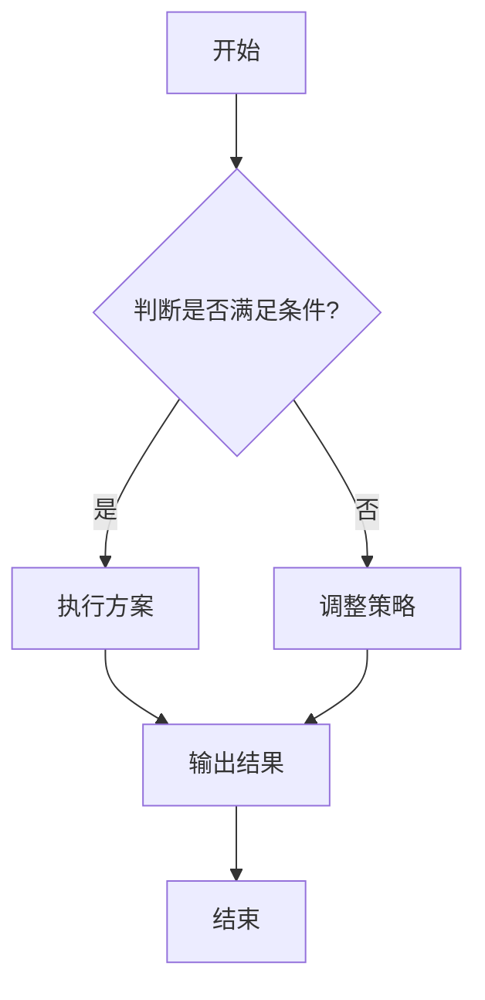
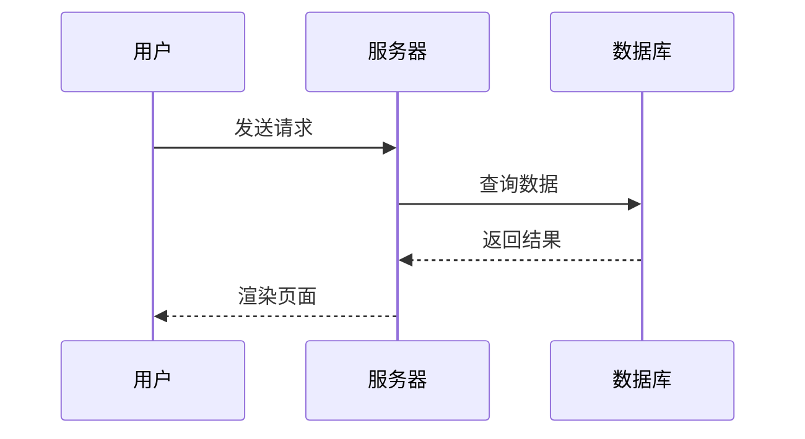
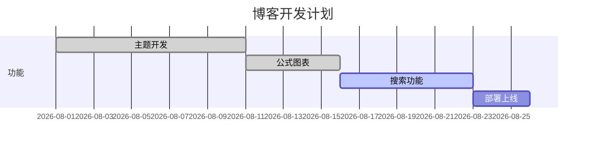

这篇示例文章覆盖本站支持的全部书写格式：多级标题、引用、链接、表格、代码块、**LaTeX 公式**、**Mermaid 图表**等。你可以直接复制任意小节到自己的文章里使用。

<!-- more -->

- [x] 多级标题 / 段落 / 行内样式
- [x] 引用、链接、列表（含任务列表）
- [x] 表格、代码块
- [x] LaTeX 公式（行内 + 块级）
- [x] Mermaid 图表（流程图 / 时序图 / 甘特图）
- [x] ABC 乐谱渲染（```abc 代码块，多声部 + 调号 + 拍号）
- [x] Chart.js 图表（line / bar / doughnut / polarArea / radar）
- [x] 水平线、图片语法说明

---

# 一级标题（对应正文 H1）

这是正文段落。Markdown 段落之间用空行分隔，**加粗**、*斜体*、***加粗斜体***、~~删除线~~、`行内代码`、以及 <mark>高亮标记</mark>（HTML 标签也可用）。

## 二级标题

### 三级标题

#### 四级标题

##### 五级标题

###### 六级标题

## 引用（Blockquote）

> 这是一个引用段落。
> 这是引用里的第二行。
>
> > 引用可以嵌套，像这样。
>
> 引用里还能混搭：**加粗**、`code`、[链接](https://example.com)。

## 链接

- 外部链接：[示例官网](https://example.com)、[文档站](https://developer.mozilla.org)
- 站内链接：[归档页](/archives/)、[关于页](/about/)
- 带标题的链接：[GitHub](https://github.com "点击访问 GitHub")
- 自动链接：<https://example.com>
- 引用式链接：[示例链接][ref-example]

[ref-example]: https://example.com "示例站点"

## 列表

### 无序列表

- 技术笔记
- 生活日常
- ACG 分享
  - 番剧推荐
  - 游戏攻略
    - 深层嵌套

### 有序列表

1. 打开终端
2. 为文章起一个吸引人的标题
3. 编辑 Markdown
4. 保存并刷新预览

### 任务列表（GFM）

- [x] 完成主题开发
- [x] 打通公式与图表
- [ ] 部署上线
- [ ] 写一篇长文

## 表格

| A | B | C |
| :--- | :---: | ---: |
| 1 | 111 | aaa |
| 2 | 222 | bbb |
| 3 | 333 | ccc |
| 4 | 444 | ddd |

> 表格支持左对齐 / 居中对齐 / 右对齐（冒号位置控制）。

## 代码块

### JavaScript

```js
// 斐波那契数列
function fib(n) {
  if (n < 2) return n;
  return fib(n - 1) + fib(n - 2);
}
console.log(fib(10)); // 55
```

### Python

```python
def greet(name: str) -> str:
    """返回问候语"""
    return f"你好，{name}！"

print(greet("世界"))
```

### Bash

```bash
git add . && git commit -m "update" && git push
```

### JSON

```json
{
  "title": "示例文章",
  "tags": ["Markdown", "教程"],
  "published": true
}
```

> 代码块自动带语法高亮和右上角「复制」按钮。

## LaTeX 公式

### 行内公式

质能方程：$E = mc^2$，勾股定理：$a^2 + b^2 = c^2$，欧拉公式：$e^{i\pi} + 1 = 0$。

用圆括号也行：\(\lim_{x \to 0} \frac{\sin x}{x} = 1\)。

### 块级公式

$$
\sum_{i=1}^{n} i = \frac{n(n+1)}{2}
$$

矩阵：

$$
\begin{pmatrix}
a_{11} & a_{12} \\
a_{21} & a_{22}
\end{pmatrix}
\begin{pmatrix}
x_1 \\
x_2
\end{pmatrix}
=
\begin{pmatrix}
b_1 \\
b_2
\end{pmatrix}
$$

方括号块级公式：

\[
\int_0^\infty e^{-x^2} \, dx = \frac{\sqrt{\pi}}{2}
\]

## Mermaid 图表

### 流程图



### 时序图



### 甘特图



## ABC 乐谱（五线谱渲染）

### 单声部：小星星（带播放）

```abc
---
tempo: 120
instrument: piano
loop: true
---
T: 小星星
C: 民谣
M: 4/4
L: 1/4
K: C
C C G G | A A G2 |
F F E E | D D C2 |
G G F F | E E D2 |
G G F F | E E D2 |
C C G G | A A G2 |
F F E E | D D C2 |
```

### 吉他六线谱

```abc
---
tablature: guitar
tempo: 100
instrument: guitar
---
T: 小星星（吉他六线谱）
M: 4/4
L: 1/4
K: G clef=treble
C C G G | A A G2 |
F F E E | D D C2 |
```

### 双声部对位

```abc
---
tempo: 140
instrument: flute
loop: true
---
T: 双声部示例
M: 3/4
L: 1/8
K: G clef=treble
V:1
| "1" d2 e f | g f e d |
V:2
| z4 A B | c B A z |
```

> **Frontmatter 语法**：在 ABC 串开头用 `---` 包 YAML 块，支持字段：
> - `tempo: 100` 速度
> - `instrument: piano|guitar|bass|flute|violin|mandolin|trumpet|drums` 乐器
> - `loop: true` 循环播放
> - `tablature: guitar` 自动加吉他/贝斯/小提琴六线谱
> - `chordgrid: "withMusic"` 在五线谱上方叠加和弦图（6.6.0+）
> - `transpose: {from: "C", to: "D"}` 一键转调（渲染版本）
> - `abcjs: '{"viewportHorizontal":true}'` 直接透传 renderAbc 的 options JSON
>
> 控制栏：▶ 播放 · ■ 停止 · 乐器下拉 · 速度滑块 · ↻ 循环 · ⤓ 下载 MIDI
>
> 语法参考：[ABC Notation 速查](https://abcjs.net/abcjs-guide/guide.html)

## Chart.js 图表（通用，基于 JSON 配置）

### 折线图

```chart
{
  "type": "line",
  "title": "历年发文量",
  "labels": ["2022", "2023", "2024", "2025", "2026"],
  "datasets": [
    { "label": "文章数", "data": [5, 18, 32, 41, 27] }
  ]
}
```

### 柱状图

```chart
{
  "type": "bar",
  "title": "分类分布",
  "labels": ["技术", "生活", "游戏", "硬件", "AI", "学习"],
  "legend": false,
  "datasets": [
    { "label": "文章数", "data": [28, 12, 16, 9, 14, 11], "color": "#FF9700" }
  ]
}
```

### 环形图

```chart
{
  "type": "doughnut",
  "title": "兴趣爱好占比",
  "legend": "right",
  "datasets": [
    { "label": "占比", "data": [30, 20, 15, 12, 13, 10] }
  ]
}
```

### 极区图

```chart
{
  "type": "polarArea",
  "title": "本月游戏时长（小时）",
  "labels": ["MC", "原神", "鸣潮", "卡拉彼丘", "Phira", "BanG Dream!", "深岩银河"],
  "max": 30,
  "datasets": [
    { "label": "时长", "data": [8, 12, 6, 4, 10, 5, 7] }
  ]
}
```

### 雷达图（旧语法向后兼容，自动补 type:radar）

```radar
{
  "title": "技能熟悉度",
  "labels": ["Python", "C++", "Web", "Godot", "硬件", "AI"],
  "max": 10,
  "datasets": [
    { "label": "现状", "data": [9, 8, 7, 6, 8, 7] },
    { "label": "目标", "data": [10, 9, 9, 8, 9, 9] }
  ]
}
```

> 所有图表自动跟随主题暖橙配色，可用 `datasets[].color` 自定义单色，多数据集自动轮换色盘。

## 图片（语法说明）

图片直接引用 `source/images/` 分类目录下的文件：

```md
<!-- 文章配图（放 images/posts/ 下） -->


<!-- 封面（front-matter 中配置） -->
cover: /images/posts/my-post/cover.webp
```

本文章的配图目录是 `markdown-format-guide`（front-matter 的 `img_dir` 字段），下面这张图就是用标签语法引用的：



## 其他格式

- 水平线：下方即是
- 上标/下标：`H~2~O`、`x^2^` 这类 GFM 写法本站不支持（会被渲染成删除线或原样输出），请用下面两种方式：
  - HTML：H<sub>2</sub>O、x<sup>2</sup>
  - 公式：$H_2O$、$x^2$
- 换行：行尾两个空格或 \<br> 标签

---


## 提示块（Admonition / Callout）

GitHub / Typora 风格的彩色提示框，支持 **note / tip / info / warning / danger / success / question** 七种类型。

`markdown
> [!warning] 升级前务必备份！
> 本次更新修改了数据库 schema，升级前请先执行 git stash + pg_dump。
`

渲染效果如下：

> [!note] 这是一条 Note
> 常规提示，用于补充说明或背景信息。

> [!tip] 小贴士
> 实用技巧和最佳实践。

> [!warning] 警告
> 需要注意的潜在风险。

> [!danger] 危险
> 可能导致数据丢失或不可逆操作。

> [!success] 成功
> 操作完成、测试通过。

> [!question] 常见问题
> FAQ 条目或思考题。

> 所有提示块可空标题（只写 > [!note] 不写内容也能渲染）。

## 图表 CSV 数据源

除了手写 `datasets` JSON，也可以用 CSV 字符串或远程 CSV 文件快速画图。CSV 格式：**第一行写列名**（第一列 = 数据集标签，后续列 = X 轴 label），**后续每行 = 一个数据集**。

### 内嵌 CSV（直接写在 markdown 里）

````markdown
```chart
{
  "type": "bar",
  "title": "年度文章分类分布（CSV）",
  "csv": "类别,技术,音乐,游戏,生活\n2024,12,4,6,8\n2025,18,7,10,11\n2026,5,3,4,6"
}
```
````

渲染效果：

```chart
{
  "type": "bar",
  "title": "年度文章分类分布（CSV）",
  "csv": "类别,技术,音乐,游戏,生活\n2024,12,4,6,8\n2025,18,7,10,11\n2026,5,3,4,6"
}
```

### 远程 CSV（fetch 加载）

````markdown
```chart
{
  "type": "line",
  "title": "长期趋势（远程 CSV）",
  "dataUrl": "/data/stats.csv"
}
```
````

渲染效果：

```chart
{
  "type": "line",
  "title": "长期趋势（远程 CSV）",
  "dataUrl": "/data/stats.csv"
}
```

> `dataUrl` 支持绝对路径 `/xxx.csv` 或完整 URL；加载失败会静默跳过，不会让图表崩。

## 明暗主题切换

点击顶部导航栏右侧的 **☾ / ☀** 圆形按钮可一键切换亮色/深色主题，偏好会存进浏览器 localStorage，下次访问自动恢复。深色下：
- 所有 CSS 变量整体切到低亮度暖色
- Chart.js 图表文字/网格色同步更新
- Admonition 提示块颜色微调避免过亮刺眼