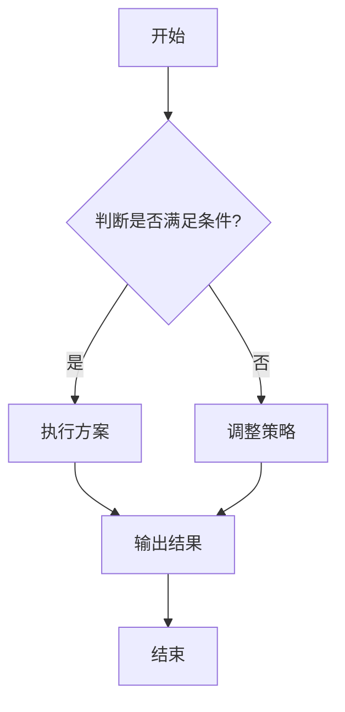
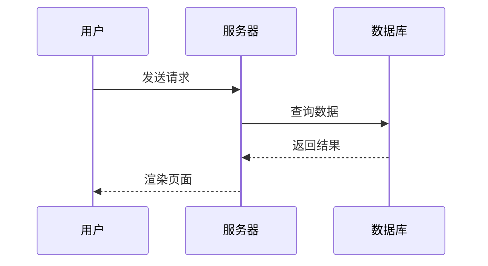
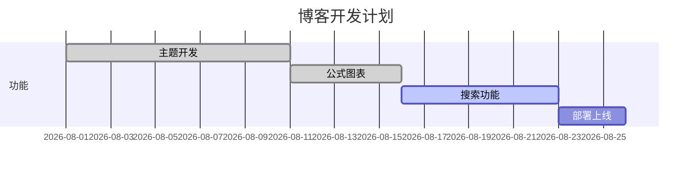

这篇示例文章覆盖本站支持的全部书写格式：多级标题、引用、链接、表格、代码块、**LaTeX 公式**、**Mermaid 图表**等。你可以直接复制任意小节到自己的文章里使用。

<!-- more -->

- [x] 多级标题 / 段落 / 行内样式
- [x] 引用、链接、列表（含任务列表）
- [x] 表格、代码块
- [x] LaTeX 公式（行内 + 块级）
- [x] Mermaid 图表（流程图 / 时序图 / 甘特图）
- [x] 水平线、图片语法说明

---

# 一级标题（对应正文 H1）

这是正文段落。Markdown 段落之间用空行分隔，**加粗**、*斜体*、***加粗斜体***、~~删除线~~、`行内代码`、以及 <mark>高亮标记</mark>（HTML 标签也可用）。

## 二级标题

### 三级标题

#### 四级标题

##### 五级标题

###### 六级标题

## 引用（Blockquote）

> 这是一个引用段落。
> 这是引用里的第二行。
>
> > 引用可以嵌套，像这样。
>
> 引用里还能混搭：**加粗**、`code`、[链接](https://example.com)。

## 链接

- 外部链接：[示例官网](https://example.com)、[文档站](https://developer.mozilla.org)
- 站内链接：[归档页](/archives/)、[关于页](/about/)
- 带标题的链接：[GitHub](https://github.com "点击访问 GitHub")
- 自动链接：<https://example.com>
- 引用式链接：[示例链接][ref-example]

[ref-example]: https://example.com "示例站点"

## 列表

### 无序列表

- 技术笔记
- 生活日常
- ACG 分享
  - 番剧推荐
  - 游戏攻略
    - 深层嵌套

### 有序列表

1. 打开终端
2. 为文章起一个吸引人的标题
3. 编辑 Markdown
4. 保存并刷新预览

### 任务列表（GFM）

- [x] 完成主题开发
- [x] 打通公式与图表
- [ ] 部署上线
- [ ] 写一篇长文

## 表格

| A | B | C |
| :--- | :---: | ---: |
| 1 | 111 | aaa |
| 2 | 222 | bbb |
| 3 | 333 | ccc |
| 4 | 444 | ddd |

> 表格支持左对齐 / 居中对齐 / 右对齐（冒号位置控制）。

## 代码块

### JavaScript

```js
// 斐波那契数列
function fib(n) {
  if (n < 2) return n;
  return fib(n - 1) + fib(n - 2);
}
console.log(fib(10)); // 55
```

### Python

```python
def greet(name: str) -> str:
    """返回问候语"""
    return f"你好，{name}！"

print(greet("世界"))
```

### Bash

```bash
git add . && git commit -m "update" && git push
```

### JSON

```json
{
  "title": "示例文章",
  "tags": ["Markdown", "教程"],
  "published": true
}
```

> 代码块自动带语法高亮和右上角「复制」按钮。

## LaTeX 公式

### 行内公式

质能方程：$E = mc^2$，勾股定理：$a^2 + b^2 = c^2$，欧拉公式：$e^{i\pi} + 1 = 0$。

用圆括号也行：\(\lim_{x \to 0} \frac{\sin x}{x} = 1\)。

### 块级公式

$$
\sum_{i=1}^{n} i = \frac{n(n+1)}{2}
$$

矩阵：

$$
\begin{pmatrix}
a_{11} & a_{12} \\
a_{21} & a_{22}
\end{pmatrix}
\begin{pmatrix}
x_1 \\
x_2
\end{pmatrix}
=
\begin{pmatrix}
b_1 \\
b_2
\end{pmatrix}
$$

方括号块级公式：

\[
\int_0^\infty e^{-x^2} \, dx = \frac{\sqrt{\pi}}{2}
\]

## Mermaid 图表

### 流程图



### 时序图



### 甘特图



## 图片（语法说明）

图片直接引用 `source/images/` 分类目录下的文件：

```md
<!-- 文章配图（放 images/posts/ 下） -->


<!-- 封面（front-matter 中配置） -->
cover: /images/posts/my-post/cover.webp
```

本文章的配图目录是 `markdown-format-guide`（front-matter 的 `img_dir` 字段），下面这张图就是用标签语法引用的：



## 其他格式

- 水平线：下方即是
- 上标/下标：`H~2~O`、`x^2^` 这类 GFM 写法本站不支持（会被渲染成删除线或原样输出），请用下面两种方式：
  - HTML：H<sub>2</sub>O、x<sup>2</sup>
  - 公式：$H_2O$、$x^2$
- 换行：行尾两个空格或 \<br> 标签

## 雷达图

```radar
{
  "title": "雷达图示例",
  "labels": ["项目1", "项目2", "项目3", "项目4", "项目5"],
  "max": 20,
  "datasets": [
    { "label": "程度1", "data": [20, 17, 13, 15, 14] },
    { "label": "程度2", "data": [12, 11, 9, 10, 18] }
  ]
}
```


---

