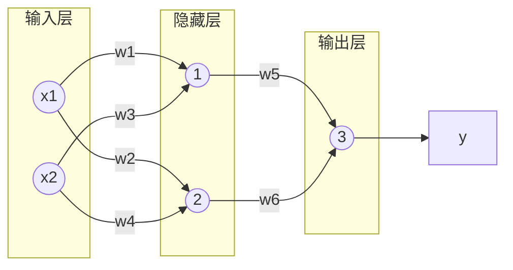
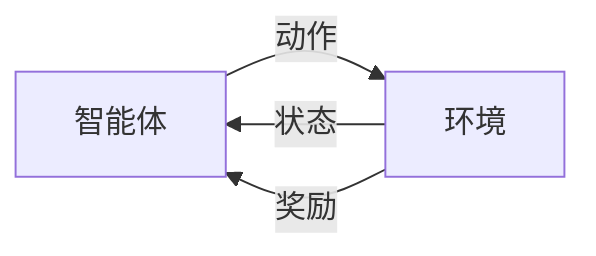
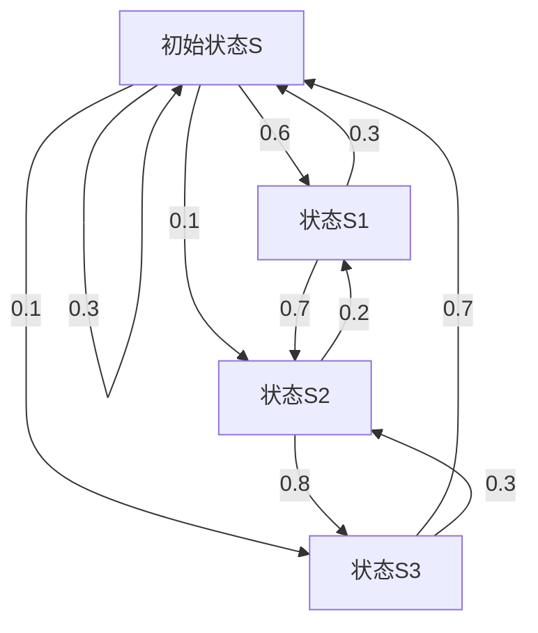
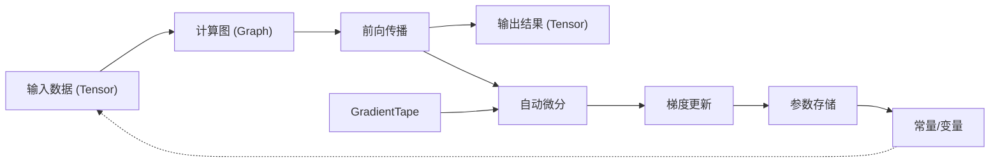

从 AlphaGO 到斯坦福小镇，人工智能正以前所未有的速度渗透各个领域。本文带你初识 AI：它如何让机器"能看、能听、能说、能想"，并聚焦神经网络与强化学习的核心思想。

<!-- more -->

# 前言

自从AlphaGO人工智能程序击败人类职业围棋选手以来，经历过三次发展浪潮的人工智能开始成为人们频繁提及的热词。近几年来，各种人工智能应用也相继出现在大众视野，人工智能这门技术逐渐受到大家的关注。

从语音助手到自动驾驶，从影像分析到，AI技术正以前所未有的速度渗透到各个领域。重塑着人类社会的运行模式。它不仅极大地提升了生产效率，优化了资源配置，更在娱乐、教育、艺术等多个维度展现出惊人的创造力与潜力，引领着人类进入一个全新的智能时代。

什么是人工智能？**人工智能（Artificial Intelligence, AI）**是一门复杂的交叉学科，它融合了计算机科学、数学、神经科学等多个领域的知识与理论。不过简单来说，人工智能就是一门研究如何让机器想人类一样，能看、能听、能说、能想、能动的技术。

在游戏领域，人工智能的应用更是为游戏世界带来了前所未有的变革，尤其是NPC（非玩家角色）智能体的进化，成为了推动游戏沉浸感与互动性提升的关键因素。

传统NPC行为模式单一，而融入AI技术后，现代游戏中的NPC借助深度学习等先进技术，能模拟复杂人类行为，不再按固定脚本行动，而是根据玩家行为、选择调整对话与行动策略，形成独特性格与成长轨迹，这种个性化设计让玩家仿若置身充满生命力的虚拟世界。电影《失控玩家》中，一位NPC意外觉醒了AI程序，这使他与其他的NPC不同，他有自己的行为、思想、情感……放在现在，人工智能技术似乎正逐步实现这个科幻的设定。

斯坦福大学的实验室对外开源了一个极具创新性的项目——“Generative Agents”，它还有一个广为人知的别名“斯坦福小镇”。在这个独特的虚拟世界里，精心设置了25个完全由AI驱动的代理智能体。这些智能体仅被赋予了预设的身份设定以及初始记忆信息，而它们后续在虚拟环境中的所有行为表现，均完全依靠AI技术来实时生成与驱动。“斯坦福小镇”让我们看到了人工智能模拟复杂社会系统的巨大潜力，也让我们进一步的见识到了人工智能的厉害之处。


再分享一个我自己的实践案例。曾经，我在为某Minecraft服务器做开发工作时，尝试为服务器大厅里的一个NPC添加了AI对话功能。具体实现原理是，通过API接口对接大语言模型，并结合预设的角色设定，让这个NPC能够根据玩家的输入生成符合角色设定的回应。这样一来，玩家在游戏中就能体验到与一个仿佛“活过来”的NPC进行互动的乐趣了。

不管怎么说，无论是AlphaGO还是“斯坦福小镇”，它们都预示着在未来的游戏中，人工智能将扮演愈发关键且多元的角色。当玩家们渴望在游戏中邂逅更具挑战性、智能性且行为模式难以预测的对手或伙伴时，要求人工智能在游戏中的应用必须具备更强的适应性、学习能力和自主决策能力。

**强化学习**作为人工智能领域中一种重要的机器学习方法，为解决这类问题提供了有效的途径。它通过智能体与环境的交互，不断试错、学习，以最大化累积奖励为目标，使智能体能够在复杂多变的环境中自主探索并找到最优策略。在众多强化学习算法中，深度Q网络（DQN）凭借其结合深度神经网络与Q学习算法的优势，能够处理高维状态空间，在许多游戏场景中取得了显著成果。

而在此文，我将在神经网络基础原理下，深入探讨如何利用DQN算法构建一个能够自主决策、不断学习进步的智能体，并尝试将我所了解到的知识和经验分享给大家，也为想开发类似项目的同好提供一个简单的范例和思路。不过事先说明，本人并非专业人士，对很多相关概念都只有比较模糊的了解，**此文仅作为分享笔记参考。**

# 理论知识

## 基础知识

### 神经元与感知器

首先，我们从零开始认识一下神经网络。神经网络最重要的一个组成单元就是“神经元”。在生物神经元中，树突负责接收来自其他神经元的信号，当这些信号的强度达到一定阈值时，细胞体就会产生电脉冲，并通过轴突将信号传递给下一个神经元。

而在人工智能的神经元模型里，同样有输入、处理和输出的过程。输入相当于生物神经元的树突接收信号，它可以接收多个数值输入；处理部分则是对这些输入进行加权求和，并加上一个偏置值，这个加权求和的过程类似于生物神经元对不同来源信号的综合考量；最后通过一个激活函数来决定是否“激活”这个神经元，使其产生输出，这就如同生物神经元达到阈值后产生电脉冲一样。


- **输入：**接收数据，这个数据可以是数值（如图像像素值、传感器数据）或前一层神经元的输出。
- **权重：**与输入对应，用于调整输入信号的强度，决定其对输出的贡献。权重是可学习的参数，通过训练过程（如反向传播）不断优化。
- **加权求和：**对所有加权输入进行加权求和，计算输入的线性组合。主要功能就是整合。
- **偏置项：**为求和结果添加一个常数项，调整神经元的激活阈值。也是可学习的参数，允许神经元在输入为零时仍能激活。
- **激活函数：**对求和结果进行非线性变换，决定神经元是否“激活”并输出信号。常见的激活函数有**Sigmoid**、**ReLU**、**Softmax**等
- **输出：**将激活函数的结果传递给下一层神经元或作为最终预测。输出的可以是连续值（回归问题）或离散值（分类问题）

接下来，我们通过一个简单的and运算来直观展示一下神经元的实现过程。and运算的规则是：**仅当所有输入均为 1 时，输出才为 1**，否则输出 0。真值表如下：

| 输入 $x_1$ | 输入 $x_2$ | 输出 $y$ |
| --- | --- | --- |
| 0 | 0 | 0 |
| 0 | 1 | 0 |
| 1 | 0 | 0 |
| 1 | 1 | 1 |

首先，我们创建一个感知器（一种单层神经网络模型，由一个神经元实现），包含以下组件：

- **输入**：$x_1, x_2$（二进制值 0 或 1）
- **权重**：$w_1, w_2$（初始值可随机设定，需通过训练优化）
- **偏置**：$b$（调整激活阈值）
- **激活函数**：使用 **阶跃函数（Step Function）**，输出 0 或 1：
$$\sigma(z) = \begin{cases} 1 & \text{if } z \geq 0 \\ 0 & \text{if } z < 0 \end{cases}$$
其中 $z = w_1 x_1 + w_2 x_2 + b$ 是加权求和结果。

我们的目标是让神经元对and运算的每一组输入输出正确结果。我们通过手动尝试或数学推导找到合适的参数。假设 $w_1 = 1$，$w_2 = 1$，$b = -1.5$，分别计算 $x_1, x_2$ 取不同值的结果：

① $x_1, x_2 = (0,0)$：$z = 1 \cdot 0 + 1 \cdot 0 - 1.5 = -1.5 \rightarrow f(z) = 0$  
② $x_1, x_2 = (0,1)$：$z = 1 \cdot 0 + 1 \cdot 1 - 1.5 = -0.5 \rightarrow f(z) = 0$  
③ $x_1, x_2 = (1,0)$：$z = 1 \cdot 1 + 1 \cdot 0 - 1.5 = -0.5 \rightarrow f(z) = 0$  
④ $x_1, x_2 = (1,1)$：$z = 1 \cdot 1 + 1 \cdot 1 - 1.5 = 0.5 \rightarrow f(z) = 1$

可以看到，我们假设的参数符合真值表的输入和输出，也就是说这个感知器成功实现了and运算。从几何的视角来看，其实就是要在二维输入空间（$x_1, x_2$）中，找到一条直线能将点 (0,0),(0,1),(1,0) 划分到一侧（输出0），点 (1,1) 划分到另一侧（输出1）。


这似乎挺简单的，对吧……？

但是，如果将目标换成异或运算（XOR），那么这里就会出现问题。如果我们仍然选择刚刚的感知器来实现，你会发现，根本不可能，因为XOR属于非线性问题，而AND不过就是个简单的线性问题罢了。即使是对于最简单的异或问题，感知器也不能拟合一条直线，将异或运算的结果划分开。用直线不行，那我们就用曲线，但是这样该怎么实现呢？使用多层感知器即可。

**多层感知器（Multilayer Perceptron,MLP）**通过引入**隐藏层**，使得其能够对输入数据进行非线性变换，将原始空间中非线性可分的数据映射到新的特征空间，在这个新空间里数据变得线性可分。

接下来，我们通过一个具体的示例来简单了解一下多层感知器的原理。还是以XOR问题为例，首先列出XOR运算的真值表做参考：

| 输入X1 | 输入X2 | 输出 |
| --- | --- | --- |
| 0 | 0 | 0 |
| 0 | 1 | 1 |
| 1 | 0 | 1 |
| 1 | 1 | 0 |

接下来，我们创建一个如下图所示的多层感知器，其中各个权重 $w_1=1$，$w_2=-1$，$w_3=-1$，$w_4=1$，$w_5=1$，$w_6=1$，偏置项 $b=-0.5$，激活函数依然选择阶跃函数。



现在我们来验证一下这个多层感知器能不能解决XOR问题。

当 $x_1=1$，$x_2=0$ 时：  
对于隐藏层的感知器1：$f_1 = \operatorname{Sgn}(w_1 x_1 + w_3 x_2 + b) = \operatorname{Sgn}(1 \times 1 + (-1) \times 0 - 0.5) = \operatorname{Sgn}(0.5) = 1$  
对于隐藏层的感知器2：$f_2 = \operatorname{Sgn}(w_2 x_1 + w_4 x_2 + b) = \operatorname{Sgn}((-1) \times 1 + 1 \times 0 - 0.5) = \operatorname{Sgn}(-1.5) = 0$  
此时对于输出层的感知器3：$y = \operatorname{Sgn}(w_5 f_1 + w_6 f_2 + b) = \operatorname{Sgn}(1 \times 1 + 1 \times 0 - 0.5) = \operatorname{Sgn}(0.5) = 1$  
结果符合 $1 \text{ XOR } 0 = 1$

…………

由于篇幅有限，其余的你可以自行验算，最后你会发现，这个多层感知器确实能够解决XOR问题。

### 损失函数、梯度下降与反向传播

在前面的例子里，所用到的权重与偏置的值都是确定且正确的（或者说是最优的），但是在实际神经网络的训练中，这些参数都是训练出来的，初始参数通常随机生成，训练过程通过不断迭代，利用**损失函数**来判断迭代的方向是否正确，再借助相关算法（如梯度下降算法）沿误差减小的方向调整参数。

神经网络的训练就像一场“登山寻宝”游戏：**损失函数**是山顶的“宝藏雷达”，它通过测量当前位置与宝藏（最优解）的距离（误差），实时告诉探险者（模型）“离目标还有多远”；**梯度下降算法**则是探险者的“智能指南针”，它根据雷达的反馈，计算脚下最陡的下坡方向（梯度），并指导探险者以合适的步长（学习率）调整路径，避免一步跨太大摔下山崖（参数发散）或步子太小原地打转（收敛慢）；而**反向传播算法**更像探险队的“地形测绘仪”，它从山顶（输出层）开始，像剥洋葱一样逐层回溯，精准计算每一层岩壁（隐藏层）对整体误差的贡献，为指南针提供详细的方向指引——三者协作，让模型在复杂的高维地形中高效找到最低点（最优参数）。

接下来我们还是以XOR问题为例子，试着还原这个过程（注：接下来会涉及到硬核的数学计算）。

还是利用上面的多层感知器，但是权重和偏置的值我们根本不知道，只能先猜。我们可以初始化以下值：

$$W^{(1)} = \begin{bmatrix} w_1 & w_3 \\ w_2 & w_4 \end{bmatrix} = \begin{bmatrix} 0.3 & -0.2 \\ -0.4 & 0.1 \end{bmatrix}, \quad b^{(1)} = \begin{bmatrix} b_1 \\ b_2 \end{bmatrix} = \begin{bmatrix} 0 \\ 0 \end{bmatrix}, \quad W^{(2)} = \begin{bmatrix} w_5 \\ w_6 \end{bmatrix} = \begin{bmatrix} 0.2 \\ -0.3 \end{bmatrix}, \quad b^{(2)} = b_3 = 0$$

在感知器1~3中，我们采用 **Sigmoid 函数**：$\sigma(z) = \frac{1}{1 + e^{-z}}$ 作为激活函数，利用 **均方误差**：$L = (y - \hat{y})^2$ 作为损失函数。输入样本 $X = [0, 0]$（对应目标值 $y = 0$）

**Step 1：前向传播计算**  
1.**输入层 → 隐藏层**：  
隐藏层节点1的输入：$z_1^{(1)} = x_1 \cdot w_1 + x_2 \cdot w_2 + b_1 = 0 \cdot 0.3 + 0 \cdot (-0.4) + 0 = 0$  
隐藏层节点1的输出：$a_1^{(1)} = \sigma(z_1^{(1)}) = \frac{1}{1 + e^{-z_1^{(1)}}} = 0.5$  
隐藏层节点2的输入：$z_2^{(1)} = x_1 \cdot w_3 + x_2 \cdot w_4 + b_2 = 0 \cdot (-0.2) + 0 \cdot 0.1 + 0 = 0$  
隐藏层节点2的输出：$a_2^{(1)} = \sigma(z_2^{(1)}) = \frac{1}{1 + e^{-z_2^{(1)}}} = 0.5$  
**2.隐藏层 → 输出层：**  
输出层的输入：$z^{(2)} = a_1^{(1)} \cdot w_5 + a_2^{(1)} \cdot w_6 + b_3 = 0.5 \cdot 0.2 + 0.5 \cdot (-0.3) + 0 = -0.05$  
输出层的输出（预测值）：$\hat{y} = \sigma(z^{(2)}) = \frac{1}{1 + e^{-z^{(2)}}} \approx 0.4875$  
  
**损失计算：** $L = (y - \hat{y})^2 = (0 - 0.4875)^2 \approx 0.2376$

**Step 2：反向传播计算**  
1. **输出层误差项**：$\delta^{(2)} = (y - \hat{y}) \cdot \sigma'(z^{(2)}) = -0.4875 \cdot 0.4875 \cdot (1 - 0.4875) \approx -0.121875$（其中，$\sigma'(z) = \sigma(z) \cdot (1 - \sigma(z))$）  
**2.隐藏层误差项**：  
节点1：$\delta_1^{(1)} = \delta^{(2)} \cdot w_5 \cdot \sigma'(z_1^{(1)}) = -0.121875 \cdot 0.2 \cdot 0.5 \cdot (1 - 0.5) \approx -0.00609375$  
节点2：$\delta_2^{(1)} = \delta^{(2)} \cdot w_6 \cdot \sigma'(z_2^{(1)}) = 0.009140625$

**Step 3：参数更新**  
1. 输出层权重 $w_5$ 更新：$w_{5,\text{new}} = w_5 + \eta \cdot \delta^{(2)} \cdot a_1^{(1)} = 0.2 + 0.1 \cdot (-0.121875) \cdot 0.5 = 0.19390625$  
同理，$w_6 = -0.30609375$  
2. 输出层偏置 $b_3$ 更新：$b_{3,\text{new}} = b_3 + \eta \cdot \delta^{(2)} = 0 + 0.1 \cdot (-0.121875) = -0.0121875$  
3. 隐藏层偏置 $b_1$ 更新：$b_{1,\text{new}} = b_1 + \eta \cdot \delta_1^{(1)} = 0 + 0.1 \cdot (-0.00609375) \approx -0.000609$  
同理，$b_2 = 0.000914$  
4. 输入层权重 $w_1$ 更新：由于 $\Delta w_1 = 0.1 \cdot (-0.00609375) \cdot 0 = 0$（$\Delta w_{i,h} = \eta \cdot \delta_h^{(1)} \cdot x_i$），因此 $w_1^{\text{new}} = w_1 + \Delta w_1 = 0.3 + 0 = 0.3$（不变化）；同理，$w_2, w_3, w_4$ 均不变化。

接下来，我们用更新后的权重和偏置重新代入前向传播，通过多次循环迭代（epochs）。在合理的学习率 $\eta$ 下，损失 $L$ 会随着迭代次数增加逐渐减小，最终趋近最小值，同时权重和偏置会更新到合适的值，这就是神经网络的训练过程。


## 扩展知识

### 强化学习

**强化学习（Reinforcement learning，RL）**是一种通过与环境互动来学习最优行为的机器学习方法。它的主要思路是让智能体（比如机器人或者游戏里的电脑角色）通过反复尝试，逐渐学会怎么做能获得最多的奖励。这种方式模仿了生物通过和环境打交道来学习最佳行为的过程。和传统的监督学习不一样，强化学习不需要提前准备好的带标签数据来训练模型，而是靠智能体自己不断尝试、犯错、调整，最后学会在特定环境中达成目标。

强化学习的理论我们可以类比**动物学习心理学**，动物学习心理学认为，动物通过不断尝试，从环境中学习技能，其中，最形象的例子就是试错法。试错法的核心思想是在不断进行试验和错误的基础上，通过反馈，逐步调整行为，以获得更好的结果。

其中，**爱德华·李·桑代克**的“**饿猫实验**”具有代表性。桑代克把饿猫关进特制迷笼，笼外放置食物，猫需触动机关才能开门取食。起初，饿猫在笼内盲目乱动，偶然碰到机关打开笼门吃到食物。随着多次重复，猫无效动作渐少，成功开门动作被强化，最终能快速准确触动机关获取食物。这一实验清晰呈现了动物凭借试错，依据行为结果反馈来调整行为的过程。这与强化学习中“智能体基于环境反馈优化策略”的逻辑高度契合。

另一个具有代表性的就是**伊万·彼得罗维奇·巴甫洛夫**的**“巴浦洛夫的狗”**实验。巴甫洛夫在研究狗的消化时发现，狗吃到食物会自然分泌唾液（无条件反射），随后他在狗进食前摇铃，反复多次后，单独摇铃也能使狗分泌唾液，这表明原本中性的铃声因与食物关联而成为条件刺激，引发了条件反射。该实验揭示了动物可通过刺激关联建立新反应。同时，巴浦洛夫的研究还强调了强化学习的概念：**动物会通过与有意义的刺激相关的行为获得奖励或惩罚，从而改变行为模式。**

#### 强化学习的框架



强化学习模型的核心主要包括**智能体（agent）**、**奖励（reward）**、**状态（state）**和**环境（environment）**四个部分：

- **智能体：**智能体是强化学习的核心要素，它主要由**策略（policy）**、**价值函数（value function）**和**模型（model）**三个部分构成。其中，**策略**可理解为一种行动规则，其作用在于指导智能体选择何种动作；**价值函数**则是对未来总奖励的一种预测；而**模型**是对环境的认知框架，能够预测智能体采取某一动作后下一个状态的变化情况。
- **奖励：**奖励是强化学习中智能体与环境交互时，从环境那里获得的反馈信号。它就像是一种“激励”机制，用来告诉智能体它刚刚采取的行动是好是坏。
- **状态：**状态是对环境当前情况的一种描述，它包含了智能体做出决策所需要的关键信息，包括环境状态、智能体状态和信息状态。可以把状态想象成给智能体的一张“环境快照”，让智能体了解自己现在身处何处、周围有什么东西等。
- **环境：**环境是智能体所处的外部世界，它是强化学习问题的大背景。环境可以是真实的物理世界，也可以是虚拟的模拟环境。

通过以上的介绍，我们可以知道，强化学习的功能非常强大，能够在智能游戏、无人驾驶、机器人控制、图像识别等多个方面发挥重要作用。

#### **马尔可夫过程**

**马尔科夫过程（Markov Process，MP）**是一种具有**马尔科夫性质**（在给定现在状态时，它与过去状态（即该过程的历史路径）是条件独立的）的随机过程，也可以称之为**马尔科夫链（Markov Chain）**。MP包含**状态**（状态空间 $S$，即状态的集合）与**转移概率**（转移矩阵 $P$，即所有状态对之间的转移概率）两个部分，可以用一个二元组 **$(S, P)$** 表示。

在离散随机过程中，假设随机变量 $s_1, s_2, \ldots, s_t, \ldots$ 构成一个随机过程，如果它具有马尔科夫性，则说明在已知历史信息 $s_1, \ldots, s_t$ 时，下一个时刻状态为 $s_{t+1}$ 的概率，即满足：

$$P(s_{t+1} \mid s_t) = P(s_{t+1} \mid s_1, \ldots, s_t)$$

从上面的公式与描述可以解读出，虽然t+1时刻状态只与t时刻的状态有关，其实t时刻的状态就已经包含了t-1的状态信息。可以这么理解：**虽然预测下一步只需要看当前这一步的状态，但当前这步的状态本身就已经“记住”了上一步是怎么走过来的信息了（如果要纵观全局，可以看出过去的历史也进行了传递与转移）。**



流程图展示的是一个基础的马尔科夫过程图，我们可以直接写出它的转移矩阵：
$$P = \begin{pmatrix} 0.3 & 0.6 & 0 & 0.1 \\ 0.3 & 0 & 0.7 & 0 \\ 0 & 0.2 & 0 & 0.8 \\ 0.7 & 0 & 0.3 & 0 \end{pmatrix}$$
我们可以直接用表格展示行（当前状态）与列（下一状态）的含义：

| 当前状态\下一状态 | S | S1 | S2 | S3 |
| --- | --- | --- | --- | --- |
| S | 0.3 | 0.6 | 0 | 0.1 |
| S1 | 0.3 | 0 | 0.7 | 0 |
| S2 | 0 | 0.2 | 0 | 0.8 |
| S3 | 0.7 | 0 | 0.3 | 0 |

我们可以选择一条路线进行演示：S-S1-S2-S3：$P = 0.6 \times 0.7 \times 0.8 = 0.336$。

上面就是一个简单的马尔科夫过程的演示，从中也能隐隐约约的感受到其功能范畴相对狭窄，至少能对付如天气预测、疾病传播等问题。不过，我们只要在它原有的框架里添上些巧妙的“改进元素”，它的表现和适用性可就大不一样了。通过巧妙地添加“改进元素”可以将马尔科夫过程“进化”成马尔科夫奖励过程与马尔科夫决策过程。

**马尔科夫奖励过程（Markov Reward Process，MRP）**是在MP的基础上加入了奖励函数（$r$）与折扣因子（$\gamma$），可以用四元组 **$(S, P, r, \gamma)$** 表示。由此我们可以看出，MRP是一个带有回报的随机过程。

**马尔可夫决策过程（Markov Decision Process, MDP）**则是在MRP的基础又加入了动作（$A$），用五元组 **$(S, A, P, r, \gamma)$** 表示，**是强化学习的最基础的理论框架。**

MDP包含以下要素：

- **状态**：对环境在某一时刻的完整描述，通常用符号 $s$ 表示，所有可能状态的集合称为状态空间 $S$。例如，在围棋游戏中，棋盘上棋子的布局就是一种状态。
- **动作**：智能体在某一状态下可以采取的行为，用符号 $a$ 表示，所有可能动作的集合称为动作空间 $A$。在围棋里，落子的位置就是动作。
- **奖励**：环境在智能体执行一个动作后反馈给智能体的一个标量值，通常用 $R$ 表示。奖励反映了该动作的好坏程度，智能体的目标就是最大化长期累积奖励。例如，在围棋中，赢得比赛可以获得正奖励，输掉比赛则获得负奖励。
- **转移概率**：描述在状态 $s$ 下采取动作 $a$ 后，转移到下一个状态 $s'$ 的概率，记为 $P(s' \mid s, a)$。它体现了环境的不确定性，例如在自动驾驶中，即使采取相同的加速动作，由于前方车辆的随机行为，车辆下一时刻的速度和位置也可能不同。
- **折扣因子**：用 $\gamma$ 表示，取值范围在 $[0, 1]$ 之间。它用于权衡当前奖励和未来奖励的重要性，$\gamma$ 越接近 1，表示智能体越重视未来的奖励；$\gamma$ 越接近 0，表示智能体更关注当前的即时奖励。

从数学的角度，MDP可以用一个五元组 $(S, A, P, R, \gamma)$ 来表示，其中：

- $S$ 是状态空间，是所有可能状态的集合。
- $A$ 是动作空间，是所有可能动作的集合。
- $P: S \times A \times S \rightarrow [0, 1]$ 是转移概率函数，$P(s' \mid s, a)$ 表示在状态 $s$ 下采取动作 $a$ 后转移到状态 $s'$ 的概率。
- $R: S \times A \times S \rightarrow \mathbb{R}$ 是奖励函数，$R(s, a, s')$ 表示在状态 $s$ 下采取动作 $a$ 后转移到状态 $s'$ 时所获得的奖励。
- $\gamma \in [0, 1]$ 是折扣因子。

#### 贝尔曼方程

**贝尔曼方程（Bellman Equation）**也被称作动态规划方程，它在强化学习领域占据着核心地位，它像一座桥梁，连接了强化学习的目标（最大化长期回报）与具体的学习方法（通过迭代更新价值函数或策略）。可以说，没有贝尔曼方程，强化学习中的许多经典算法（如Q-learning、动态规划、值迭代、策略迭代等）都无法成立。

贝尔曼方程有很多分类，分为状态值函数的贝尔曼期望方程（给定策略 $\pi$）、动作值函数的贝尔曼期望方程（给定策略 $\pi$）、最优状态值函数的贝尔曼最优方程、最优动作值函数的贝尔曼最优方程，以及矩阵形式的贝尔曼方程。

① **给定策略 $\pi$**：**状态价值函数的贝尔曼期望方程**：
$$V^\pi(s) = \sum_{a} \pi(a \mid s) \left[ R(s, a) + \gamma \sum_{s'} P(s' \mid s, a) V^\pi(s') \right]$$

- $V^\pi(s)$：在策略 $\pi$ 下，状态 $s$ 的价值函数。
- $\pi(a \mid s)$：在状态 $s$ 下选择动作 $a$ 的概率。
- $R(s, a)$：在状态 $s$ 执行动作 $a$ 后立即获得的奖励。
- $\gamma$：折扣因子（$0 \leq \gamma \leq 1$），权衡当前和未来奖励的重要性。
- $P(s' \mid s, a)$：在状态 $s$ 执行动作 $a$ 后转移到状态 $s'$ 的概率。
- $V^\pi(s')$：在策略 $\pi$ 下，状态 $s'$ 的价值函数。

② **给定策略 $\pi$**：**动作价值函数的贝尔曼期望方程**：
$$Q^\pi(s, a) = R(s, a) + \gamma \sum_{s'} P(s' \mid s, a) \sum_{a'} \pi(a' \mid s') Q^\pi(s', a')$$

- $Q^\pi(s, a)$：在策略 $\pi$ 下，状态 $s$ 执行动作 $a$ 的动作价值函数。
- $R(s, a)$：在状态 $s$ 执行动作 $a$ 后立即获得的奖励。
- $\gamma$：折扣因子。
- $P(s' \mid s, a)$：在状态 $s$ 执行动作 $a$ 后转移到状态 $s'$ 的概率。
- $\pi(a' \mid s')$：在状态 $s'$ 下选择动作 $a'$ 的概率。
- $Q^\pi(s', a')$：在策略 $\pi$ 下，状态 $s'$ 执行动作 $a'$ 的动作价值函数。

③ **最优状态价值函数的贝尔曼最优方程**：
$$V^{\ast}(s) = \max_{a} \left[ R(s, a) + \gamma \sum_{s'} P(s' \mid s, a) V^{\ast}(s') \right]$$

- $V^{\ast}(s)$：最优策略下状态 $s$ 的价值函数。
- $\max_{a}$：对所有可能的动作 $a$ 取最大值。
- $R(s, a)$：在状态 $s$ 执行动作 $a$ 后立即获得的奖励。
- $\gamma$：折扣因子。
- $P(s' \mid s, a)$：在状态 $s$ 执行动作 $a$ 后转移到状态 $s'$ 的概率。
- $V^{\ast}(s')$：最优策略下状态 $s'$ 的价值函数。

④ **最优动作价值函数的贝尔曼最优方程**：
$$Q^{\ast}(s, a) = R(s, a) + \gamma \sum_{s'} P(s' \mid s, a) \max_{a'} Q^{\ast}(s', a')$$

- $Q^{\ast}(s, a)$：最优策略下状态 $s$ 执行动作 $a$ 的动作价值函数。
- $R(s, a)$：在状态 $s$ 执行动作 $a$ 后立即获得的奖励。
- $\gamma$：折扣因子。
- $P(s' \mid s, a)$：在状态 $s$ 执行动作 $a$ 后转移到状态 $s'$ 的概率。
- $\max_{a'}$：对所有可能的动作 $a'$ 取最大值。
- $Q^{\ast}(s', a')$：最优策略下状态 $s'$ 执行动作 $a'$ 的动作价值函数。

***未完待续……***

#### Q-learning与DQN

**Q-Learning**是一个非常的经典的强化学习方法，它的核心思路是：通过不断调整“状态-动作”对应的价值 $Q(s, a)$ 来找到最优策略。

了解：时序差分学习算法
> **时序差分学习**属于无模型的学习方法，不用提前知道环境的情况就能开始学习。它结合了蒙特卡洛方法和动态规划算法的优点。它的核心想法是，用现在的预测值去更新之前的预测值，这样一步步地就能越来越接近真实的预测值。
>
> 有意思的是，**时序差分学习算法**的运行方式和大脑里产生多巴胺的神经元活动有奇妙联系，很可能这就是大脑学习和做决定的基础。**多巴胺**是大脑的神经调节剂，生物体要是得到奖励，多巴胺神经元就会更活跃，然后生物体就会接着做类似的行为，把自己的行为策略变强；要是碰到惩罚，多巴胺神经元就不那么活跃了，生物体就会避免再做同样的行为，减少惩罚的机会。

具体来说，它用**贝尔曼方程**一步步“猜”出真实的Q值，而且不需要提前知道环境的具体规则（无模型），还能边学边用（离线学习）。不过它有个短板——早期版本得用表格记录所有可能的 $Q(s, a)$，遇到像图像这种高维数据就搞不定了。

为突破这一瓶颈，Deep Q-Network（DQN）应运而生，它用神经网络近似Q函数，并引入经验回放（Experience Replay）和目标网络（Target Network）两大关键技术：前者通过随机采样历史数据打破样本相关性（类似“错题本”），后者通过固定目标值稳定训练过程（类似“参考答案”），从而成功将强化学习应用于游戏等复杂场景，成为无模型强化学习的里程碑。

---

接下来我们来介绍一下Q-learning，在Q-learning下，环境会根据智能体的动作反馈相应的奖励值，我们可以将状态与行为构建成一份Q表来存储Q值，然后根据Q值来选取能够获得最大收益的动作：

1. 初始化Q表为0；
2. 随机初始化Q函数为任意值为起点；
3. 根据ε-贪心算法在当前状态 $s$ 的所有可能行动中选择一个行动 $a$，并转到下一个状态；
4. 在新状态上选择 $Q$ 值最大的行动 $a$，利用贝尔曼方程更新上一个状态 $Q$ 值；
5. 将新状态设为当前状态，重复2-4步骤，直到达到目标状态结束。

**更新公式**（基于**最优动作价值函数**的**贝尔曼最优方程**）：
$$\underbrace{Q(s, a)}_{\text{当前动作价值}} \leftarrow \underbrace{Q(s, a)}_{\text{旧值}} + \alpha \left[ \underbrace{R(s, a)}_{\text{即时奖励}} + \gamma \underbrace{\max_{a'} Q(s', a')}_{\substack{\text{下一状态} \\ \text{最大动作价值}}} - \underbrace{Q(s, a)}_{\text{旧值}} \right]$$

***ε-贪心算法***
> ***ε-贪心算法**是一种平衡"探索"与"利用"的决策策略：以 $\varepsilon$ 概率随机尝试新选择（探索未知可能），以 $1-\varepsilon$ 概率选择当前最优选项（利用已知信息）。例如 $\varepsilon = 0.1$ 时，90%选目前最好的，10%随机尝试，既避免因固执错过更好解，又防止因盲目探索效率低下，是强化学习中最常用的动作选择方法。*

接下来，我们进一步介绍DQN。简单来说，DQN就是利用神经网络来拟合Q函数，同时又引入了经验回放和目标网络两大关键技术模块。为此，我们需要引入一些神经网络训练所必需的公式，比如参数更新公式和损失函数等。


参数更新公式：
$$\underbrace{\theta}_{\text{网络参数}} \leftarrow \underbrace{\theta}_{\text{当前参数}} - \alpha \underbrace{\nabla_\theta \left[ \frac{1}{N} \sum_{i=1}^N \left( \underbrace{y_i}_{\text{目标Q值}} - \underbrace{Q(s_i, a_i; \theta)}_{\text{预测Q值}} \right)^2 \right]}_{\text{损失函数梯度}}$$

$\alpha$：学习率，控制梯度下降步长  
$\nabla_\theta$：参数梯度，指导网络参数更新方向  
$N$：经验回放池采样的批量大小

对于 $Q(s_i, a_i; \theta)$：  
$s_i$：状态，以多维向量表示，是智能体对环境的观测结果  
$a_i$：动作，可以是离散整数，代表智能体可选的行为  
$\theta$：神经网络中权重矩阵集合

目标Q值可以展开为
$$\underbrace{y_i}_{\text{目标Q值}} = \underbrace{r_i}_{\text{即时奖励}} + \gamma \underbrace{\max_{a'} Q(s'_i, a'; \theta^-)}_{\substack{\text{目标网络计算的} \\ \text{下一状态最大Q值}}}$$

$\theta^-$：目标网络参数（固定周期更新，如每1000步同步一次）  
$s'_i$：从经验回放池采样的第 $i$ 个转移样本的下一状态  
$\gamma$：折扣因子，未来奖励的衰减率，平衡短期收益与长期收益  
$y_i$：目标Q值，理想情况下的Q值标签，提供网络学习的监督信号  
$r_i$：即时奖励，环境反馈的瞬时收益，引导智能体识别即时有利动作

而我们可以选用损失函数：
$$\underbrace{L(\theta)}_{\text{损失函数}} = \underbrace{\frac{1}{N} \sum_{i=1}^N \left( \underbrace{y_i}_{\text{目标Q值}} - \underbrace{Q(s_i, a_i; \theta)}_{\text{预测Q值}} \right)^2}_{\text{均方误差}}$$

---


# 准备工作

## 安装Python

有了以上的理论基础，现在我们来实战一下。首先，请在你的电脑里安装一个[Python](https://www.python.org/)，不过你需要注意的是，在此项目中，python版本不是越高越好，你需要根据实际情况进行版本选择，不然容易出现不兼容的情况。在本项目中，我使用Python3.11.9。在python官网中下载对应版本的python，安装时一定要记得把安装pip工具（Install pip）与环境变量（Add Python to PATH）给勾选上。

安装完成后，点击`win+R`输入`cmd`回车，打开命令提示符，输入`python`，如果出现类似以下字样的文本，说明安装成功。

`Python 3.11.9 (tags/v3.11.9:de54cf5, Apr 2 2024, 10:12:12) [MSC v.1938 64 bit (AMD64)] on win32  
Type "help", "copyright", "credits" or "license" for more information.`

## 安装代码编辑器

接下来，安装[Visual Studio Code](https://code.visualstudio.com/)作为我们的代码编辑器（如果你用记事本我也不会拦着你的）。下载安装完成后，打开程序，找到扩展，并搜索"python",下载这个插件后，还要配置Python解释器，你可以输入`Ctrl+Shift+P`后输入`Python: Select Interpreter`选择已安装的Python路径。现在，在Visual Studio Code里创建一个python文件，并在第一行输入`print("hello world")`，运行此文件后如果在控制台输出了hello world，则说明Visual Studio Code配置完成。

## 安装第三方库

> ***温馨提示：如果你担心你整体的python环境会因为下载了过多的第三方库而变得混乱，你可以尝试利用虚拟环境进行项目开发。利用`python -m venv <虚拟环境的名称>`指令进行创建，然后用`<虚拟环境的名称>\Scripts\activate.bat`开启你的虚拟环境，接下来你就可以在这个虚拟环境里大干一场了。***

接着，重难点来了。我们需要安装一系列有助于我们开发的第三方库。首先是深度学习框架，当前的深度学习框架有TensorFlow、PyTorch、Keras、Caffe等，而在此文中，我使用的是TensorFlow。

TensorFlow可以说是当今最受欢迎的深度学习框架之一，且它支持python、JavaScript、C++、Java等多种编程语言。此外，Tensorflow不仅具有强大的计算集群，还可以在IOS、Android等移动平台上运行模型。

接下来还有一些辅助型的第三方库，比如科学计算库[NumPy](https://numpy.org/)、数据图形化库[Matplotlib](https://matplotlib.org/)、游戏运行库[Pygame](https://www.pygame.org/news)……这里我就不过多的介绍了。

在python中按照第三方库的方法就是在命令提示符里使用`pip install <第三方库名称>`进行安装，例如安装pygame，一般使用`pip install numpy`进行安装。如果出现安装失败的情况，请自行搜索解决方法。安装成功后，在命令行输入`python`，然后输入`import numpy`以验证是否能成功导入，没有什么异常的提示就说明安装成功，其它的库也是同理。

可能有些教程会让你安装[Anaconda](https://www.anaconda.com/download)，但在我的这个项目里其实按照以上步骤进行就可以实现，如果你要实现更复杂的神经网络项目，那么确实可以考虑装一个Anaconda，甚至还要考虑是否要安装Tensorflow的GPU版本。由于GPU版本的配置环节非常非常非常的复杂，对于我当前的研究完全不必要，用计算机的CPU足矣。

**到此为止，我们完成了所有的准备工作。**

# 开发环节

## 预热练手

### TensorFlow基础用法


TensorFlow 是谷歌开发的开源深度学习框架，以**计算图（Graph）**为核心，通过**张量（Tensor）**流动实现数据计算。它支持从简单数学运算到复杂神经网络的全流程开发，并兼容CPU/GPU/TPU加速。TensorFlow 还拥有丰富庞大的生态系统：以 TensorFlow Core 为核心，涵盖适用于移动和嵌入式设备的 TensorFlow Lite、用于网页端的 TensorFlow.js、提供预训练模型的 TensorFlow Hub 以及辅助可视化的 TensorBoard，全面支持不同场景的机器学习开发与应用。

- 什么是**张量**？它其实就是多维数组，是TensorFlow的数据载体，分为：0阶张量：标量（如 5）、1阶张量：向量（如 [1, 2, 3]）、2阶张量：矩阵（如 [[1, 2], [3, 4]]）、高阶张量：如3D图像数据（[batch, height, width, channels]），这样就把数据统一进行表示，简化了操作。
- 什么是**计算图**？它是由节点（操作，如加法、矩阵乘法）和边（数据流，即代表数据流动的路径）构成的有向图，定义了计算逻辑，能够优化计算流程，提升性能。
- 什么是**会话(Session)**？: 它负责执行计算图的运行环境，分配计算资源（如GPU）并返回结果。


Tensorflow安装完毕后，我们可以用`import tensorflow as tf`尝试导入，并利用`tf.__version__`获取版本号，若有正常输出，则说明安装成功。默认下，它仅在CPU设备上运行，你可以使用`tf.config.list_physical_devices('GPU')`来检查是否有GPU环境（输出类似`[PhysicalDevice(name='/physical_device:GPU:0', device_type='GPU')]`）。

#### 定义张量以及张量操作

> *备注：以下内容采用Tensorflow2.x*

在前面我们说到，张量可以是标量、向量、矩阵。张量可分为**常量（Constant）**与**变量（Variable）**，常量顾名思义就是不可变的张量，可以用来存储超参数（学习率等）、存储不参与训练的配置数据、作为计算中的固定值等；变量则是可变的张量，通常用来存储模型参数。

我们可以利用`tf.constant(<tensor>)`创建常量，其中`<tensor>`可以是`1,2,3,4`这样的标量，可以是`[1,2,3,4]`这样的向量（用数组（列表）表示），还可以是`[[1,2],[3,4]]`这样的矩阵（用嵌套式数组（列表）表示）。

接下来我们来简单的进行一下张量的计算。我们先定义2个矩阵A与B，并对其进行加法与乘法运算：

```python
import tensorflow as tf
a = tf.constant([[1, 2], [3, 4]])
b = tf.constant([[5, 6], [7, 8]])
add = tf.add(a, b) # 加法
matmul = tf.matmul(a, b) # 矩阵乘法
print("加法结果:\n", add.numpy())
print("矩阵乘法结果:\n", matmul.numpy())
```

矩阵 $A = \begin{bmatrix} 1 & 2 \\ 3 & 4 \end{bmatrix}$，$B = \begin{bmatrix} 5 & 6 \\ 7 & 8 \end{bmatrix}$，矩阵加法为：$(A + B)_{ij} = A_{ij} + B_{ij}$，乘法公式为：$C = AB$，其中 $C_{ij} = \sum_{k=1}^{2} A_{ik} B_{kj}$

$$A + B = \begin{bmatrix} 1+5 & 2+6 \\ 3+7 & 4+8 \end{bmatrix} = \begin{bmatrix} 6 & 8 \\ 10 & 12 \end{bmatrix}$$

$$\begin{aligned} C_{11} &= A_{11}B_{11} + A_{12}B_{21} = 1 \times 5 + 2 \times 7 = 19 \\ C_{12} &= A_{11}B_{12} + A_{12}B_{22} = 1 \times 6 + 2 \times 8 = 22 \\ C_{21} &= A_{21}B_{11} + A_{22}B_{21} = 3 \times 5 + 4 \times 7 = 43 \\ C_{22} &= A_{21}B_{12} + A_{22}B_{22} = 3 \times 6 + 4 \times 8 = 50 \end{aligned}$$

因此 $AB = \begin{bmatrix} 19 & 22 \\ 43 & 50 \end{bmatrix}$

如果是创建变量，则可以利用`tf.Variable(<tensor>)`创建：

```python
import tensorflow as tf

# 定义变量
w = tf.Variable(1.0)        # 标量变量（初始值1.0）
x = tf.Variable([1, 2, 3])  # 向量变量
y = tf.Variable([[1, 2], [3, 4]])  # 矩阵变量

# 更新变量的值
w.assign(2.0)               # 直接赋值
x.assign_add([1, 1, 1])     # 增量更新（x = x + [1,1,1]）
y.assign(y * 2)             # 重新赋值（y = y * 2）

print("w (更新后):", w.numpy())       # 输出: 2.0
print("x (增量更新后):", x.numpy())   # 输出: [2 3 4]
print("y (乘法更新后):\n", y.numpy()) # 输出: [[2 4] [6 8]]
```

---

**自动微分**是深度学习框架的核心功能之一，它能够自动计算函数的导数（梯度），无需手动推导。在 TensorFlow框架中，自动微分通过**计算图和反向传播算法**实现。

```python
import tensorflow as tf

# 定义变量（需要梯度跟踪）
x = tf.Variable(3.0, name="x")

# 定义计算（前向传播）
with tf.GradientTape() as tape:  # 开启梯度记录
    y = x ** 2 + 2 * x + 1  # y = x² + 2x + 1

# 计算梯度（反向传播）
dy_dx = tape.gradient(y, x)  # dy/dx = 2x + 2
print("梯度 dy/dx:", dy_dx.numpy())  # 输出: 8.0 (因为 x=3.0)
```

上述代码，我们定义一个计算：$y = x^2 + 2x + 1$，对其求导：$\frac{dy}{dx} = 2x + 2$，当 $x = 3$ 时，$\left. \frac{dy}{dx} \right|_{x=3} = 2 \times 3 + 2 = 8$

---

以下就是Tensorflow的工作流程框架：



#### **Keras**

**Keras** 是 TensorFlow 的高级深度学习 API，它以简洁、模块化的设计让用户能够快速构建和训练神经网络。

##### 相关概念

- **模型（Model）**：Keras 的核心数据结构，是组织神经网络层的方式。包含①**Sequential API**：线性堆叠层，适合简单的网络（如全连接网络、CNN）。②**Functional API**：支持复杂拓扑（如多输入/输出、残差连接）。
- **层（Layer）**：层是 Keras 的基本构建块，每个层接收输入数据，进行某种计算后输出结果。Keras 也提供丰富的预定义层，例如：`Dense`（全连接层）、`Conv2D`（二维卷积层）、`LSTM`（长短期记忆层）等
- **优化器（Optimizer）**：用于更新模型参数，如`Adam`、`SGD`。
- **回调函数（Callback）**：控制训练过程（如 `EarlyStopping`、`ModelCheckpoint`）。
- **激活函数（Activation Function）**：略（前文已介绍）。可使用的有ReLU 、Sigmoid、Tanh、Softmax。
- ……

##### 使用方法

**定义模型：**利用`Sequential(<layers_list>)`通过列表传入层结构；利用`Dense(<units>, activation=<func>, input_shape=<shape>)`定义神经网络节点类型。

- `input_shape`为输入数据的形状（仅第一层需要，如 `(2,)`）
- `units`指神经元数量（如 `2` 或 `1`）
- `activation`为激活函数（如 `'sigmoid'`）

```python
from tensorflow.keras.models import Sequential
from tensorflow.keras.layers import Dense

model = Sequential([
    Dense(2, activation='sigmoid', input_shape=(2,)),  # 第一层：2个神经元，Sigmoid激活
    Dense(1, activation='sigmoid')                     # 输出层：1个神经元，Sigmoid激活
])
```

**编译模型：**使用`SGD(learning_rate=<value>)`创建随机梯度下降优化器；利用`model.compile(optimizer=<opt>, loss=<loss_func>)`完成编译模型工作。

- `loss`为损失函数（如 `'mse'` 或 `'binary_crossentropy'`）
- `optimizer`是优化器对象（如 `SGD` 或字符串 `'adam'`）

```
optimizer = SGD(learning_rate=0.1)  # 随机梯度下降优化器，学习率=0.1
model.compile(optimizer=optimizer, loss='mse')  # 使用均方误差（MSE）作为损失函数
```

**回调函数：**每 1000 个 epoch 打印一次当前损失值（`logs['loss']`）。利用`LambdaCallback(on_epoch_end=<lambda_func>)`创建回调函数。其中，`on_epoch_end`是在每个 epoch 结束时调用的函数。*（参数 `epoch` 是当前轮数，`logs` 是包含损失和指标的字典）*

```
print_loss_callback = LambdaCallback(
    on_epoch_end=lambda epoch, logs: print(f"Epoch {epoch}, Loss: {logs['loss']:.4f}") if epoch % 1000 == 0 else None
)
```

**模型训练：**利用`model.fit(<X>, <y>, epochs=<num>, batch_size=<size>, verbose=<level>, callbacks=<list>)`进行模型训练：

- X, y：输入数据和标签。
- epochs：训练轮数。
- batch\_size：每个批次的样本数（1 表示在线学习）。
- verbose：控制训练日志输出（0 为静默）。
- callbacks：回调函数列表（如 [print\_loss\_callback]）。

```
model.fit(
    X, y,
    epochs=10000,    # 训练 10000 轮
    batch_size=1,    # 批量大小为 1（逐样本训练）
    verbose=0,       # 不显示默认进度条
    callbacks=[print_loss_callback]  # 传入回调函数
)
```

**模型测试（预测）：**利用`model.predict(<X>, verbose=<level>)`进行模型预测。

- `X`：输入数据
- `verbose`：控制预测日志输出（`0` 为静默）

```
predictions = model.predict(X, verbose=0)  # 预测输入数据的输出
```

更多详细内容，可以查看[TensorFlow 高级 API – Keras | 菜鸟教程](https://www.runoob.com/tensorflow/tensorflow-api-keras.html)

### 多层感知器实例：XOR问题

在正式开发主项目前，我们先用一个神经网络小项目练练手。还记得在前面章节我们提到的XOR问题吗？前面的章节里，我们通过数学推导详细拆解了神经网络的训练原理。接下来，我们将这一过程转换成Python代码：

xor.py

```python
import math
import random

class NeuralNetwork:
    def __init__(self, input_size, hidden_size, output_size):
        # 初始化权重（随机值在 -0.5 到 0.5 之间）
        self.weights_input_hidden = [[random.uniform(-0.5, 0.5) for _ in range(hidden_size)] for _ in range(input_size)]
        self.weights_hidden_output = [[random.uniform(-0.5, 0.5) for _ in range(output_size)] for _ in range(hidden_size)]
        
        # 初始化偏置
        self.bias_hidden = [0.0 for _ in range(hidden_size)]
        self.bias_output = [0.0 for _ in range(output_size)]
        
        # 学习率
        self.learning_rate = 0.1
    
    def sigmoid(self, x):
        return 1 / (1 + math.exp(-x))
    
    def sigmoid_derivative(self, x):
        return x * (1 - x)
    
    def forward(self, X):
        # 输入层 → 隐藏层
        self.hidden_input = [0.0 for _ in range(len(self.bias_hidden))]
        for h in range(len(self.hidden_input)):
            sum_hidden = 0.0
            for i in range(len(X)):
                sum_hidden += X[i] * self.weights_input_hidden[i][h]
            self.hidden_input[h] = sum_hidden + self.bias_hidden[h]
        
        # 隐藏层激活
        self.hidden_output = [self.sigmoid(x) for x in self.hidden_input]
        
        # 隐藏层 → 输出层
        self.output_input = [0.0 for _ in range(len(self.bias_output))]
        for o in range(len(self.output_input)):
            sum_output = 0.0
            for h in range(len(self.hidden_output)):
                sum_output += self.hidden_output[h] * self.weights_hidden_output[h][o]
            self.output_input[o] = sum_output + self.bias_output[o]
        
        # 输出层激活
        self.predicted_output = [self.sigmoid(x) for x in self.output_input]
        return self.predicted_output
    
    def backward(self, X, y, output):
        # 计算输出层误差
        output_error = [y[o] - output[o] for o in range(len(output))]
        output_delta = [output_error[o] * self.sigmoid_derivative(output[o]) for o in range(len(output))]
        
        # 计算隐藏层误差
        hidden_error = [0.0 for _ in range(len(self.hidden_output))]
        for h in range(len(self.hidden_output)):
            error = 0.0
            for o in range(len(output_delta)):
                error += output_delta[o] * self.weights_hidden_output[h][o]
            hidden_error[h] = error
        hidden_delta = [hidden_error[h] * self.sigmoid_derivative(self.hidden_output[h]) for h in range(len(self.hidden_output))]
        
        # 更新隐藏层 → 输出层权重
        for h in range(len(self.hidden_output)):
            for o in range(len(output_delta)):
                self.weights_hidden_output[h][o] += self.learning_rate * output_delta[o] * self.hidden_output[h]
        
        # 更新输出层偏置
        for o in range(len(output_delta)):
            self.bias_output[o] += self.learning_rate * output_delta[o]
        
        # 更新输入层 → 隐藏层权重
        for i in range(len(X)):
            for h in range(len(hidden_delta)):
                self.weights_input_hidden[i][h] += self.learning_rate * hidden_delta[h] * X[i]
        
        # 更新隐藏层偏置
        for h in range(len(hidden_delta)):
            self.bias_hidden[h] += self.learning_rate * hidden_delta[h]
    
    def train(self, X, y, epochs=10000):
        for epoch in range(epochs):
            # 遍历所有训练样本
            for i in range(len(X)):
                input_data = X[i]
                target = y[i]
                
                # 前向传播
                output = self.forward(input_data)
                
                # 反向传播
                self.backward(input_data, target, output)
            
            # 每 1000 次打印一次损失
            if epoch % 1000 == 0:
                loss = sum((y[i][0] - self.forward(X[i])[0]) ** 2 for i in range(len(X))) / len(X)
                print(f"Epoch {epoch}, Loss: {loss:.4f}")
    
    def predict(self, X):
        output = self.forward(X)
        return [round(output[0])]  

# XOR 训练数据
X = [[0, 0], [0, 1], [1, 0], [1, 1]]
y = [[0], [1], [1], [0]]

# 创建并训练神经网络
nn = NeuralNetwork(input_size=2, hidden_size=2, output_size=1)
nn.train(X, y, epochs=50000)

# 测试
print("\nPredictions:")
for x in X:
    pred = nn.predict(x)
    print(f"Input: {x}, Output: {pred[0]}")
```

上述代码大概有100行，毕竟我们是从零开始搭建神经网络、定义算法函数的；但实际上，我们可以借助Tensorflow这样的深度神经网络框架来提升开发效率：

```python
import tensorflow as tf
from tensorflow.keras.models import Sequential
from tensorflow.keras.layers import Dense
from tensorflow.keras.optimizers import SGD
from tensorflow.keras.callbacks import LambdaCallback
import numpy as np

# XOR 训练数据
X = np.array([[0, 0], [0, 1], [1, 0], [1, 1]], dtype=np.float32)
y = np.array([[0], [1], [1], [0]], dtype=np.float32)

# 创建神经网络模型
model = Sequential([Dense(2, activation='sigmoid', input_shape=(2,)), Dense(1, activation='sigmoid')])

# 编译模型
optimizer = SGD(learning_rate=0.1)
model.compile(optimizer=optimizer, loss='mse')

# 定义回调函数，每1000轮打印一次损失
print_loss_callback = LambdaCallback(on_epoch_end=lambda epoch, logs: print(f"Epoch {epoch}, Loss: {logs['loss']:.4f}") if epoch % 1000 == 0 else None)

# 训练模型
print("开始训练...")
model.fit(X, y,epochs=10000,batch_size=1,  verbose=0,callbacks=[print_loss_callback])

# 测试模型
print("\nPredictions:")
predictions = model.predict(X, verbose=0)
for i in range(len(X)):
    input_data = X[i].tolist()
    pred = round(predictions[i][0])
    print(f"Input: {input_data}, Output: {int(pred)}")
```

上面的代码仅仅用了大约30行，就可以将之前的代码还原，可见深度神经网络框架可以让我们省去很多工作。不过，我们这个是一个非常非常简单的神经网络，用神经网络框架（第三方库）不是很见效，因为框架本身的设计往往针对复杂模型与大规模数据，其冗余功能反而会拖慢运行速度。但是，用来作为演示和练手足矣。

### Q-learning实例：迷宫

我们可以创建一个4x4的迷宫，添加与墙功能相同的障碍物，设置起点和终点，目标是让程序"摸出"最优路线。迷宫规则为：程序智能体碰到墙或障碍物时停留原地并受-1惩罚；到达终点时获得+10奖励并结束当前回合。将智能体位置作为状态，上下左右四个方向作为动作，奖励机制设计为：到达终点+10（目标激励），触碰障碍物/撞墙-1（惩罚错误），普通移动-0.1（鼓励高效路径）。

---

参考代码

```python
import numpy as np
import turtle
import time
import random
import matplotlib.pyplot as plt  

class GridWorldConfig:
    def __init__(self):
        self.grid_size = 4
        self.start = (0, 0)
        self.goal = (3, 3)
        self.obstacles = [(1, 1), (2, 2)]
        self.actions = ['up', 'down', 'left', 'right']
        self.num_episodes = 100
        self.max_steps = 100
        self.alpha = 0.1  # 学习率
        self.gamma = 0.9  # 折扣因子
        self.epsilon = 0.1  # 探索率

def get_user_config():
    config = GridWorldConfig()
    
    print("欢迎使用网格世界Q-learning模拟器")
    print("请配置您的网格世界参数（直接回车使用默认值）")
    
    # 网格大小
    size = input(f"网格大小 (默认 {config.grid_size}): ")
    if size.isdigit() and int(size) > 1:
        config.grid_size = int(size)
    
    # 起点
    start = input(f"起点坐标 (格式: x,y 默认 {config.start}): ")
    if start:
        try:
            x, y = map(int, start.split(','))
            if 0 <= x < config.grid_size and 0 <= y < config.grid_size:
                config.start = (x, y)
        except:
            print("输入格式错误，使用默认值")
    
    # 终点
    goal = input(f"终点坐标 (格式: x,y 默认 {config.goal}): ")
    if goal:
        try:
            x, y = map(int, goal.split(','))
            if 0 <= x < config.grid_size and 0 <= y < config.grid_size:
                config.goal = (x, y)
        except:
            print("输入格式错误，使用默认值")
    
    # 障碍物
    obstacles = input(f"障碍物坐标 (格式: x1,y1 x2,y2 ... 默认 {config.obstacles}): ")
    if obstacles:
        obs_list = []
        try:
            for obs in obstacles.split():
                x, y = map(int, obs.split(','))
                if 0 <= x < config.grid_size and 0 <= y < config.grid_size:
                    if (x, y) != config.start and (x, y) != config.goal:
                        obs_list.append((x, y))
            if obs_list:
                config.obstacles = obs_list
        except:
            print("输入格式错误，使用默认值")
    
    # 训练参数
    episodes = input(f"训练回合数 (默认 {config.num_episodes}): ")
    if episodes.isdigit() and int(episodes) > 0:
        config.num_episodes = int(episodes)
    
    steps = input(f"每回合最大步数 (默认 {config.max_steps}): ")
    if steps.isdigit() and int(steps) > 0:
        config.max_steps = int(steps)
    
    alpha = input(f"学习率 (0-1 默认 {config.alpha}): ")
    if alpha and 0 <= float(alpha) <= 1:
        config.alpha = float(alpha)
    
    gamma = input(f"折扣因子 (0-1 默认 {config.gamma}): ")
    if gamma and 0 <= float(gamma) <= 1:
        config.gamma = float(gamma)
    
    epsilon = input(f"探索率 (0-1 默认 {config.epsilon}): ")
    if epsilon and 0 <= float(epsilon) <= 1:
        config.epsilon = float(epsilon)
    
    return config

# 环境类
class GridWorld:
    def __init__(self, config):
        self.grid_size = config.grid_size
        self.start = config.start
        self.goal = config.goal
        self.obstacles = config.obstacles
        self.actions = config.actions
        self.state = self.start
        self.done = False
    
    def reset(self):
        self.state = self.start
        self.done = False
        return self.state
    
    def step(self, action):
        if self.done:
            raise ValueError("Episode has finished")
        
        x, y = self.state
        
        # 执行动作
        if action == 'up' and x > 0:
            x -= 1
        elif action == 'down' and x < self.grid_size - 1:
            x += 1
        elif action == 'left' and y > 0:
            y -= 1
        elif action == 'right' and y < self.grid_size - 1:
            y += 1
        
        # 检查是否碰到障碍物
        if (x, y) in self.obstacles:
            reward = -1
            self.done = True
        # 检查是否到达终点
        elif (x, y) == self.goal:
            reward = 10
            self.done = True
        # 撞墙
        elif self.state == (x, y):
            reward = -1
        # 普通移动
        else:
            reward = -0.1
        
        self.state = (x, y)
        return (x, y), reward, self.done

# 选择动作（ε-贪婪策略）
def choose_action(state, Q, actions, epsilon):
    if random.random() < epsilon:
        return random.choice(actions)
    else:
        x, y = state
        action_idx = np.argmax(Q[x, y])
        return actions[action_idx]

# 绘制环境
def draw_grid(config):
    screen = turtle.Screen()
    screen.title("Q-Learning 网格世界")
    size = 500
    screen.setup(size, size)
    screen.setworldcoordinates(-1, -1, config.grid_size, config.grid_size)
    screen.tracer(0)  
    
    drawer = turtle.Turtle()
    drawer.speed(0)
    drawer.hideturtle()
    
    # 绘制网格
    for i in range(config.grid_size + 1):
        drawer.penup()
        drawer.goto(0, i)
        drawer.pendown()
        drawer.goto(config.grid_size, i)
        
        drawer.penup()
        drawer.goto(i, 0)
        drawer.pendown()
        drawer.goto(i, config.grid_size)
    
    # 标记起点、终点和障碍物
    def draw_square(x, y, color, text=""):
        drawer.penup()
        drawer.goto(x, y)
        drawer.pendown()
        drawer.color("black", color)
        drawer.begin_fill()
        for _ in range(4):
            drawer.forward(1)
            drawer.left(90)
        drawer.end_fill()
        
        if text:
            drawer.penup()
            drawer.goto(x + 0.5, y + 0.5)
            drawer.color("white")
            drawer.write(text, align="center", font=("Arial", max(8, 16 - config.grid_size), "bold"))
            drawer.color("black")
    
    # 绘制起点（绿色方形）
    draw_square(config.start[0], config.start[1], "green", "S")
    # 绘制终点（红色方形）
    draw_square(config.goal[0], config.goal[1], "red", "G")
    # 绘制障碍物（灰色方形）
    for obs in config.obstacles:
        draw_square(obs[0], obs[1], "gray")
    
    return screen, drawer

# 可视化智能体移动
def visualize_agent(drawer, state, grid_size):
    drawer.clear()
    x, y = state
    drawer.penup()
    drawer.goto(x + 0.5, y + 0.5)
    drawer.dot(max(15, 200/grid_size), "blue")

# 显示最优策略
def show_optimal_policy(drawer, Q, config):
    drawer.clear()
    
    # 重绘网格
    for i in range(config.grid_size + 1):
        drawer.penup()
        drawer.goto(0, i)
        drawer.pendown()
        drawer.goto(config.grid_size, i)
        
        drawer.penup()
        drawer.goto(i, 0)
        drawer.pendown()
        drawer.goto(i, config.grid_size)
    
    # 重绘起点、终点和障碍物
    def draw_square(x, y, color, text=""):
        drawer.penup()
        drawer.goto(x, y)
        drawer.pendown()
        drawer.color("black", color)
        drawer.begin_fill()
        for _ in range(4):
            drawer.forward(1)
            drawer.left(90)
        drawer.end_fill()
        
        if text:
            drawer.penup()
            drawer.goto(x + 0.5, y + 0.5)
            drawer.color("white")
            drawer.write(text, align="center", font=("Arial", max(8, 16 - config.grid_size), "bold"))
            drawer.color("black")
    
    draw_square(config.start[0], config.start[1], "green", "S")
    draw_square(config.goal[0], config.goal[1], "red", "G")
    for obs in config.obstacles:
        draw_square(obs[0], obs[1], "gray")
    
    # 绘制最佳路径
    path = find_best_path(Q, config)
    if path:
        path_turtle = turtle.Turtle()
        path_turtle.speed(0)
        path_turtle.hideturtle()
        path_turtle.color("blue")
        path_turtle.width(2)
        
        path_turtle.penup()
        path_turtle.goto(path[0][0] + 0.5, path[0][1] + 0.5)
        path_turtle.pendown()
        
        for step in path[1:]:
            path_turtle.goto(step[0] + 0.5, step[1] + 0.5)

# 根据Q表找到最佳路径
def find_best_path(Q, config):
    path = []
    state = config.start  
    path.append(state)
    visited = set()
    
    for _ in range(config.grid_size * 4):  
        if state == config.goal:  
            break
        if state in visited:  
            return None
        visited.add(state)
            
        x, y = state
        best_action_idx = np.argmax(Q[x, y])
        best_action = config.actions[best_action_idx]
        
        # 执行动作
        if best_action == 'up' and x > 0:
            state = (x - 1, y)
        elif best_action == 'down' and x < config.grid_size - 1:
            state = (x + 1, y)
        elif best_action == 'left' and y > 0:
            state = (x, y - 1)
        elif best_action == 'right' and y < config.grid_size - 1:
            state = (x, y + 1)
        
        # 检查是否碰到障碍物
        if state in config.obstacles:
            return None
            
        path.append(state)
    
    return path if path[-1] == config.goal else None

# 打印Q表
def print_q_table(Q, config, title):
    print(f"\n{title} Q表:")
    action_symbols = {'up': '↑', 'down': '↓', 'left': '←', 'right': '→'}
    
    for x in range(config.grid_size):
        for y in range(config.grid_size):
            if (x, y) in config.obstacles:
                print(f"位置 ({x},{y}): 障碍物")
                continue
            if (x, y) == config.goal:
                print(f"位置 ({x},{y}): 终点")
                continue
            if (x, y) == config.start:
                print(f"位置 ({x},{y}): 起点")
                continue
                
            best_action_idx = np.argmax(Q[x, y])
            best_action = config.actions[best_action_idx]
            
            action_values = [f"{action_symbols[action]}:{Q[x,y,i]:.2f}" 
                           for i, action in enumerate(config.actions)]
            print(f"位置 ({x},{y}): 最佳动作={action_symbols[best_action]}, Q值=[{', '.join(action_values)}]")

# 数据图表
def plot_rewards(rewards, config):
    plt.figure(figsize=(10, 5))
    plt.rcParams['font.sans-serif'] = ['SimHei', 'Microsoft YaHei', 'WenQuanYi Zen Hei', 'sans-serif']  
    plt.rcParams['axes.unicode_minus'] = False  
    window_size = 10
    smoothed_rewards = np.convolve(rewards, np.ones(window_size)/window_size, mode='valid')
    plt.plot(range(1, len(rewards)+1), rewards, 'b-', alpha=0.3, label='原始奖励')
    plt.plot(range(window_size-1, len(rewards)), smoothed_rewards, 'r-', label=f'滑动平均')
    plt.axhline(y=0, color='gray', linestyle='--', alpha=0.5)
    plt.axhline(y=10, color='green', linestyle='--', alpha=0.5, label='目标奖励')
    plt.xlabel('回合数')
    plt.ylabel('奖励')
    plt.title('Q-Learning训练奖励变化曲线')
    plt.legend()
    plt.grid(True, alpha=0.3)
    plt.xlim(0, len(rewards))
    plt.tight_layout()
    plt.show()

# Q-Learning 训练
def q_learning(config):
    # 初始化Q表
    Q = np.zeros((config.grid_size, config.grid_size, len(config.actions)))
    
    env = GridWorld(config)
    screen, drawer = draw_grid(config)
    agent = turtle.Turtle()
    agent.speed(0)
    agent.hideturtle()

    rewards_history = []
    
    # 打印初始Q表
    print_q_table(Q, config, "初始")
    
    for episode in range(config.num_episodes):
        state = env.reset()
        visualize_agent(agent, state, config.grid_size)
        total_reward = 0
        
        for step in range(config.max_steps):
            # 选择动作
            action = choose_action(state, Q, config.actions, config.epsilon)
            action_idx = config.actions.index(action)
            
            # 执行动作
            next_state, reward, done = env.step(action)
            total_reward += reward
            
            # 更新Q表(贝尔曼方程的应用)
            x, y = state
            next_x, next_y = next_state
            best_next_action = np.argmax(Q[next_x, next_y])
            td_target = reward + config.gamma * Q[next_x, next_y, best_next_action]
            td_error = td_target - Q[x, y, action_idx]
            Q[x, y, action_idx] += config.alpha * td_error
            
            # 移动智能体
            visualize_agent(agent, next_state, config.grid_size)
            screen.update()
            time.sleep(0.05)
            
            state = next_state
            
            if done:
                break
        
        # 记录奖励
        rewards_history.append(total_reward)
        print(f"回合: {episode + 1}/{config.num_episodes}, 总奖励: {total_reward:.1f}")
    
    # 打印最终Q表
    print_q_table(Q, config, "最终")
    
    # 显示最优策略和路径
    show_optimal_policy(drawer, Q, config)
    screen.update()
    
    # 显示最佳路径
    path = find_best_path(Q, config)
    if path:
        print("\n找到的最佳路径:")
        print(" → ".join([f"({x},{y})" for x, y in path]))
    else:
        print("\n未能找到有效路径")
    
    # 绘制数据图表
    plot_rewards(rewards_history, config)
    
    #turtle.done()

# 主程序
def main():
    use_custom = input("是否要自定义网格世界配置? (y/n, 默认 n): ").lower() == 'y'
    
    if use_custom:
        config = get_user_config()
    else:
        config = GridWorldConfig()
    
    q_learning(config)

if __name__ == "__main__":
    main()
```

---

当然，在原有代码基础上，我对其功能进行了扩展。利用 turtle 库完成了程序运行流程的可视化呈现，通过图形化的界面，我们能够直观的感受程序执行的步骤；以及，对于数据，我利用matplotlib做了数据可视化处理。同时，引入了自定义配置模块，允许用户依据实际需求，对迷宫的规模、障碍物分布等关键参数进行自主设定。


图片展示的是算法训练过程中的最优路径与数据可视化结果。从奖励趋势图可见，训练初期（0~55回合）智能体处于深度探索阶段，因密集障碍物导致奖励持续为负，反映出空间认知的艰难过程；第56回合首次突破至7.9的正奖励，标志着成功发现绕过障碍带的有效路径。此后Q表进入快速优化期，通过贝尔曼方程将终点奖励（+10）反向传播至前驱状态，形成从(0,1)→(5,4)的"价值走廊"。最终200回合训练完成后，关键路径Q值稳定收敛，算法自动规划出唯一最优路径，验证了Q-learning在复杂障碍环境中的路径规划能力。

---

**最终Q表：**

| **位置坐标** | **↑ (上)** | **↓ (下)** | **← (左)** | **→ (右)** | **价值特征** |
| --- | --- | --- | --- | --- | --- |
| (0,1) | -0.32 | -0.52 | -0.37 | **2.92** | 右移价值主导 |
| (0,2) | -0.19 | **3.75** | -0.33 | -0.23 | 下移价值峰值 |
| (0,3) | -0.27 | **1.32** | -0.27 | -0.34 | 下移局部最优 |
| (1,2) | 0.07 | -0.41 | -0.34 | **4.57** | 右移价值跃升 |
| (1,3) | -0.09 | -0.41 | 0.37 | **5.36** | 右移价值延续 |
| (1,4) | -0.19 | **6.17** | 0.76 | -0.12 | 下移价值突破 |
| (2,4) | 0.86 | **7.00** | -0.19 | -0.34 | 下移价值递增 |
| (3,4) | 1.24 | **7.91** | 0.53 | -0.02 | 接近终点价值 |
| (4,4) | 1.30 | **8.90** | -0.27 | -0.27 | 终点前驱峰值 |
| (5,4) | 0.07 | 0.71 | -0.34 | **10.00** | 终点直达价值 |
| (0,5) | -0.20 | -0.11 | -0.19 | -0.29 | 无显著价值 |
| (3,0) | -0.25 | -0.26 | -0.47 | -0.17 | 低价值区域 |
| (5,0) | -0.23 | -0.30 | -0.30 | -0.22 | 低价值区域 |

以上是Q-learning算法的具体演示。在迷宫环境中，Q-learning通过表格存储每个状态的价值，像背诵固定答案的学生，在4x4等简单迷宫中表现高效，但面对10x10复杂迷宫或更多障碍物时，因Q表维度爆炸和泛化能力缺失而力不从心。

针对这样的问题，我们可以引入神经网络，将Q-learning升级成DQN，让智能体像掌握规律的导航员，能通过经验回放和目标网络机制，从大量数据中提取"靠近目标奖励增加""避开障碍物"等通用法则，不仅能处理任意规模的网格世界，还能快速适应新环境，实现从"死记硬背"到"随机应变"的质变。

接下来，我们尝试为前面的迷宫挑战的Q-learning升级成DQN。前文我们介绍了一堆复杂的公式，说实在的，将那些公式转换成代码非常费脑子，不过好在我们可以尝试利用AI工具辅助我们编程。

经过一次训练后，我获得了以下数据（代码见后文的[源码](#snake_dqn_code)链接）：


显然，在 10x10 这种相对简单的迷宫环境中，DQN 并不能充分展现其优势。在这种情况下，直接使用 Q-learning 算法，或者 A\*、Dijkstra 等经典寻路算法，往往就能高效地找到最优解。DQN 的价值更多体现在面对更庞大、更复杂的迷宫（例如状态空间剧增、规则更加多变）时，它相较于Q-learning才更能体现出处理高维状态空间的能力和优势。当然，本代码的主要目标是演示如何用 DQN 解决此类路径规划问题，并验证其基本可行性。

---

---

## 项目开发：贪吃蛇DQN智能体

前文，我们已经非常详细地讲解了神经网络的基本原理以及强化学习的基本原理，还通过示例演示了相关算法。接下来，我将分享自己第一次尝试将神经网络应用于游戏的经历。从这一部分开始，文章内容将更偏向于日记式分享，而非先前的学术探讨。

[点击下载源码](https://www.123865.com/s/nUR0Vv-j84k3)

### 源码分析

**游戏环境模块 (src/game/env.py)**  
该模块实现了贪吃蛇游戏的核心逻辑。主要通过`PyGameSnakeEnv`类来封装游戏状态、规则和交互。`reset`方法用于将游戏重置到初始状态，`step`方法处理每一步的执行和反馈（新状态、奖励、是否结束），而`_get_state`方法则将复杂的二维游戏画面抽象成AI可理解的12维状态向量，这是强化学习算法感知环境的关键。

> **贪吃蛇游戏逻辑：**初始化游戏时，需要设置游戏环境状态，包括初始化蛇的位置、食物的位置、蛇的移动方向、得分等。游戏地图通常用一个逻辑上的二维网格表示（通过坐标范围定义）。蛇的身体由一系列坐标点（元组）组成，通常使用列表（List）或双端队列（deque）来存储这些坐标。游戏的核心循环是处理每一步的移动：根据当前方向计算蛇头的新位置；进行碰撞检测，判断新位置是否合法（是否撞墙或撞到自身），若发生碰撞则游戏结束；进行食物检测，判断新位置是否与食物位置重合，若吃到食物，则蛇身增长（得分增加，生成新的食物位置），否则蛇身整体移动（移除尾部，添加新的头部）。食物生成通过在地图范围内随机选取一个不与蛇身重叠的位置来实现。整个过程涉及条件判断、状态更新和循环控制。
>
> **强化学习关键参数：**  
> 1.状态：食物相对位置（2维：水平/垂直方向的归一化距离）、当前移动方向（4维：上下左右）、四周危险检测（4维：上/下/左/右方向是否有障碍物或边界）、蛇身长度（1维：归一化长度）、得分（1维：归一化得分）  
> 2.动作：上、下、左、右  
> 3.奖励机制：
>
> - **食物奖励**：+20；
> - **距离奖励**：**正向奖励**：`+0.1`（当蛇头更接近食物时）；**负向惩罚**：`-0.05`（当蛇头远离食物时）；
> - **基础步长奖励**：+0.2
> - **碰撞惩罚**：-15

**模型模块 (src/model/q\_network.py)**  
此模块定义了DQN算法的核心——神经网络模型。`QNetwork`类同时维护了两个网络：主网络（`model`）用于实时决策，目标网络（`target_model`）用于稳定训练目标。其网络结构（输入12维，两个隐藏层128和64神经元，输出4维）是针对贪吃蛇问题状态和动作空间设计的。该模块不仅负责前向传播（预测Q值），还封装了反向传播（`train`方法）的细节，是深度强化学习的核心计算单元。

> **神经网络：**主网络和目标网络共享相同的结构，由3层全连接层（128/64个神经元）和批量归一化层构成，输出层为线性激活，直接预测各动作的Q值。使用`Huber`损失函数平衡异常值敏感度，`Adam`优化器动态调整学习率，结合TensorFlow的`GradientTape`实现自动微分和梯度更新。

**训练模块 (src/trainer/trainer.py & src/utils/agent\_trainer.py)**  
训练模块是项目的核心执行引擎。`trainer.py`作为高层入口，负责初始化所有必要的组件（模型、环境、日志器、监控器等）并启动训练。核心的训练逻辑则在`agent_trainer.py`中实现。它执行标准的DQN训练循环：在每个训练轮次（episode）中，AI与环境交互，将经验存储到经验回放缓冲区（`replay_buffer.py`），然后从中随机采样批次数据来更新主网络。它还负责定期同步主网络到目标网络，并通过`model_manager`和`train_log`进行模型保存和日志记录。

**配置模块 (src/utils/config.py & config.json)**  
配置模块实现了“配置与代码分离”，让使用者能够更快捷的配置参数。其中，`config.json`是一个JSON文件，集中存放了所有可调的超参数（如学习率、网络结构、训练轮次等）和路径设置。`config.py`脚本负责读取并解析这个JSON文件，将其内容转化为Python中的类属性（如`Config.EPISODES`），供项目其他模块方便地调用。这种方式使得调整参数变得非常便捷，无需修改代码。

**工具脚本模块 (src/tools/)**  
项目包含了一系列实用的工具脚本，以支持开发、测试、监测和部署。`vismodel.py`用于查看模型结构，`tester.py`用于加载训练好的模型并进行全面的性能评估，生成图表和游戏录像。`k2tflite.py`和`tflite2c.py`则为模型的后续部署（如嵌入式设备）提供了格式转换功能（不过暂未验证可行性）。`r_installer.py`简化了项目依赖的安装过程，提升了环境搭建的效率。

**日志、监控与状态管理**：项目内置了完善的日志和监控机制。`train_log.py`将训练指标（如分数、损失）同时记录到CSV文件和TensorBoard日志中，便于后续分析和可视化。`tmonitor.py`提供了键盘快捷键控制，允许用户在训练过程中手动保存模型或中断训练。`t_state.py`则负责记录训练状态（如当前轮次、模型路径），使得训练过程可以从中断点恢复，避免从头开始。

更多内容，请查看ReadMe.md文件！

### 开发历程

由于本人对人工智能的好奇，再加上自己对游戏开发的兴趣，此项目也是突发奇想出来的。但我当时可啥都不会，所以，光是理论学习就花了很长时间。之后，在借助AI辅助编程下，我成功的完成了此项目的第一个版本。之所以会选择贪吃蛇这个游戏作为我探究DQN的具体示例，是因为我当初刚开始学python时，制作的第一款游戏就是贪吃蛇，而且python本身就跟蛇有关（x）。

项目正式立项后，我着手于第一个版本的开发与框架的搭建，不过很快，我完成了初始版本的开发，成功搭建起基本的游戏逻辑框架，同时整合了神经网络模型与强化学习算法，为项目打下了坚实的基础。

随后，我首次开展项目可行性研究并开启第一轮训练，同时添加了对训练过程的监控、日志记录和按键操作功能。接着，通过pygame实现游戏环境可视化，优化了神经网络模型结构，开发了用于评估模型性能的模型测试工具。

第一轮训练结束后，神经网络模型虽初步展现学习效果，但测试表现不佳。不过，后续我完善了目标网络的更新逻辑，调整了部分训练参数；同时添加了模型转换工具，可将tflite模型转换为C数组（转换后的数组可用性暂未验证）。

之后，项目进入了更深入的测试与优化阶段。在经过一小段时间的调整后，我正式开启了第二轮测试训练，而这次训练的核心目标之一，就是验证目标网络更新逻辑的可行性，幸运的是，我达成了这一目标。并且我还添加了TensorBoard实时监控训练状态，这让我能更精准地掌握训练动态。

第二轮训练结束后，我也展开了对模型的评估工作：最终模型的测试表现差强人意，还需要进一步优化，但测试数据却意外显示，训练中期产出的模型表现十分良好。基于这一发现，我调整了相关参数，马不停蹄地开启了第三轮训练测试。

接下来，是整个项目的第三代版本更新。我对整个项目进行了全面重构，将相关部分进行模块化处理，进一步优化了代码结构，让项目的扩展性和维护性大幅提升。除此之外，我还添加了第二个模型转换工具，专门用于将.keras模型转换为.tflite格式；新增了run.bat脚本，让项目启动变得更加便捷；同时将参数配置单独提取到config.json文件中，方便后续的管理和调整。不过这一阶段也并非一帆风顺，我尝试搭建GPU训练环境，希望能提升训练效率，但最终以失败告终，这个目标只能留到后续继续攻克。

为了让参数配置更便捷，我利用tkinter开发了简易的GUI界面；同时，我还尝试编写arduino代码，希望能在ESP32-S3上运行模型，可惜这次尝试并未成功。而在第三轮训练过程中，我发现了一个奇怪的现象：如果进行长时间训练，loss会呈现阶梯式上升，可一旦中途重启训练，loss就会迅速断崖式下降，之后又会阶段性上升，这个奇怪的问题一直困惑着我。

随后，我再次向GPU训练发起了冲击——经过多次失败后，我成功的配置好了GPU环境，并添加了GPU装置选择功能，终于能在有GPU的环境下进行训练了。为了适配GPU训练，我还移除了训练代码中结束训练生成数据图表的功能。初步尝试的结果让人振奋，GPU版本的训练速度有明显提升，但新的问题也随之而来：由于第三方库的兼容性问题，部分辅助功能容易无法运行，仍需进一步优化；更关键的是，GPU训练模式下出现了内存泄漏问题，这直接影响训练的稳定性，必须尽快分析解决。

让人意外的是，在当前版本的实际训练中，我发现CPU训练速度竟然比GPU更快，这和我的预期完全相反；同时还出现了不同设备训练下模型无法继承的问题，这两个问题都需要深入分析原因。带着这些疑问，我专门针对模型无法继承的问题展开了分析与实验，最终找到了症结——程序无法正确读取先前的训练轮次，导致每次都要从头开始训练。不过由于之前的代码重构工作没做到位，又引发了各种新问题，只能一步步慢慢解决。

问题一个个被攻克，我成功解决了无法继承训练轮次的问题，还对相关功能进行了进一步优化；同时修复了特定调试信息反复出现的问题；通过调整算法结构，GPU环境下的训练速度也有了明显提升。但挑战并未结束，我发现GPU模式下推理模型时无法正确读取，而CPU模式下模型却能正常运行，这个设备适配的问题还需要继续探究。不过，后续经过验证，我找到了一个野方法解决这个问题：当GPU模式训练生成的模型无法被识别时，先切回CPU模式，训练几轮后，就能在CPU模式下识别读取了。

经过一系列的迭代优化，我开展了连续不间断的训练，最终成功完成了总计10000轮的训练任务，并且获得了相对可观的数据。但是经过分析后发现（数据见附录二），模型的推理表现并不是很优秀，跟神经网络的结构、训练参数、奖励机制等都有关系（毕竟也是草草的搭建出来的）。不过经过这一次的开发，不仅让我了解到了强化学习，同时为诸如此类的项目的推进积累了宝贵的数据和经验。

***接下来，我计划打造一个机制更复杂的贪吃蛇游戏系统，如增加双人对战、技能和特殊食物等，并构建全新深度学习框架驱动。设计复杂训练系统，先通过模仿学习阶段，利用传统游戏AI框架（如贪心探索、寻路规避等）作为专家系统，让神经网络学习贪吃蛇基础玩法；再进入强化学习阶段，采用PPO算法优化策略。同时，将遗传算法融入训练过程，用于筛选神经网络结构、权重、训练超参数及奖励权重等参数……希望能够进一步的研究深度强化学习这一领域。***

## 总结

整篇文章我们围绕着人工智能展开，通过对神经网络原理的深入分析，以及对强化学习算法的演示，深入探讨了DQN（深度Q网络）在简易游戏环境下的可行性。我们不仅从理论层面分析了DQN如何借助神经网络强大的拟合能力，将游戏状态映射为最优动作，还通过具体的示例，如智能体在经典游戏环境中的表现，直观展示了DQN在解决序列决策问题上的独特魅力，让我们切实感受到人工智能在游戏领域的巨大潜力。

同样的，DQN也存在着许多我们不能忽视的缺点。比如，DQN训练过程不稳定，容易出现震荡、难以收敛等问题。这主要是因为DQN在更新目标值时，使用的是同一个网络既进行动作选择又进行价值评估，这种“自举”的方式容易导致估计偏差的累积，进而使得训练过程波动较大。而且，DQN对经验回放池中样本的采样是均匀的，没有考虑到不同样本对学习的重要性差异，这也在一定程度上影响了训练效率和效果。此外，DQN还存在Q值过估计的问题，即它倾向于高估动作的Q值，这可能会导致智能体选择次优的动作，从而影响整体性能。

虽然有像Double DQN、Dueling DQN等这样的DQN优化版本，但它们也只是在一定程度上缓解了上述问题，并未从根本上彻底解决。而且，随着游戏环境复杂度的不断增加，这些优化后的DQN算法在处理高维状态空间和大规模动作空间时，仍然会面临计算资源消耗大、训练时间长等问题。

> **致谢：特别感谢[Coryzen](https://space.bilibili.com/381647702)为我提供想法建议与硬件设备**

## 附录一：CPU与GPU环境参考

| 环境维度 | CPU模式 | GPU模式 |
| --- | --- | --- |
| Python版本 | 3.11 | 3.10 |
| 附加配置 | 无 | Anaconda：24.9.2 CUDA：11.5 cuDNN：8.9.7 |

| 依赖库名称 | CPU版本 | GPU版本 |
| --- | --- | --- |
| **numpy** | **2.3.4** | **1.22.0** |
| **tensorflow** | **2.20.0** | **2.10.0（tensorflow-gpu）** |
| matplotlib | 3.10.0 | None（暂未测试） |
| keyboard | 0.13.5 | 0.13.5 |
| tqdm | 4.67.1 | 4.67.1 |
| colorama | 0.4.6 | 0.4.6 |
| pygame | 2.6.1 | 2.6.1 |
| Pillow | 12.0.0 | 12.0.0 |
| pathlib | 1.0.1 | 1.0.1 |

## 附录二：某次训练与推理的部分数据图表和效果演示


# 参考

1. [[2309.07864] The Rise and Potential of Large Language Model Based Agents: A Survey](https://arxiv.org/abs/2309.07864)
2. [[2304.03442] Generative Agents: Interactive Simulacra of Human Behavior](https://arxiv.org/abs/2304.03442)
3. [Python安装、卸载及环境配置全指南：解决常见问题与报错-腾讯云开发者社区-腾讯云](https://cloud.tencent.com/developer/article/2588757)
4. [Python安装与VSCode配置保姆级教程\_vscode安装python库-CSDN博客](https://blog.csdn.net/2401_82819685/article/details/146186751)
5. [用感知器实现简单逻辑运算](https://learn-udacity.top/umle668514z/%E6%9C%BA%E5%99%A8%E5%AD%A6%E4%B9%A0%E5%B7%A5%E7%A8%8B%E5%B8%88/Part%2003-Module%2001-Lesson%2002_%E6%84%9F%E7%9F%A5%E5%99%A8%E7%AE%97%E6%B3%95/07.%20%E7%94%A8%E6%84%9F%E7%9F%A5%E5%99%A8%E5%AE%9E%E7%8E%B0%E7%AE%80%E5%8D%95%E9%80%BB%E8%BE%91%E8%BF%90%E7%AE%97.html)
6. [神经网络基本概念-CSDN博客](https://blog.csdn.net/weixin_74387857/article/details/134298084)
7. [TensorFlow 教程 | 菜鸟教程](https://www.runoob.com/tensorflow/tensorflow-tutorial.html)
8. [Pygame 首页 — pygame v2.6.0 文档](https://www.pygame.org/docs/)
9. [pygame零基础入门\_pygame教程-CSDN博客](https://blog.csdn.net/m0_46403734/article/details/136535806)
10. [Python安装第三方库常用方法 超详细~-CSDN博客](https://blog.csdn.net/wongyinger/article/details/122890031)
11. [VSCode安装配置使用教程（最新版超详细保姆级含插件）一文就够了\_vscode使用教程-CSDN博客](https://blog.csdn.net/msdcp/article/details/127033151)
12. [anaconda的安装和使用（管理python环境看这一篇就够了）-CSDN博客](https://blog.csdn.net/tqlisno1/article/details/108908775)
13. [Tensorflow-gpu保姆级安装教程（Win11, Anaconda3，Python3.9）-CSDN博客](https://blog.csdn.net/weixin_43412762/article/details/129824339)
14. [在 Windows 环境中从源代码构建  |  TensorFlow](https://tensorflow.google.cn/install/source_windows?hl=zh-cn#gpu)
15. [强化学习入门：基本思想和经典算法 - 知乎](https://zhuanlan.zhihu.com/p/466455380)
16. [伊万·彼得罗维奇·巴甫洛夫\_百度百科](https://baike.baidu.com/item/%E4%BC%8A%E4%B8%87%C2%B7%E5%BD%BC%E5%BE%97%E7%BD%97%E7%BB%B4%E5%A5%87%C2%B7%E5%B7%B4%E7%94%AB%E6%B4%9B%E5%A4%AB/4460369)
17. [桑代克（动物心理学的开创者）\_百度百科](https://baike.baidu.com/item/%E6%A1%91%E4%BB%A3%E5%85%8B/1762751)
18. [强化学习 马尔科夫决策过程（MDP）详解-CSDN博客](https://blog.csdn.net/litterfinger/article/details/156422075)
19. [一文读懂强化学习：RL全面解析与Pytorch实战\_强化学习实战-CSDN博客](https://blog.csdn.net/magicyangjay111/article/details/132645347)
20. [机器学习：监督学习、无监督学习、半监督学习、强化学习-CSDN博客](https://blog.csdn.net/lsb2002/article/details/132005658)
21. [贝尔曼方程(Bellman Equation) - 知乎](https://zhuanlan.zhihu.com/p/688029400)
22. [“贝尔曼方程”那些事儿:含贝尔曼方程详细推导，通俗易懂\_贝尔曼方程推导-CSDN博客](https://blog.csdn.net/qq_41936559/article/details/142644560)
23. [【强化学习】Q-Learning 迷宫算法案例\_q学习走迷宫陷入循环-CSDN博客](https://blog.csdn.net/Gilgame/article/details/90669032)
24. [强化学习Q-learning算法——Python实现 - 郝hai - 博客园](https://www.cnblogs.com/haohai9309/p/18203233)
25. [强化学习 7—— 一文读懂 Deep Q-Learning（DQN）算法\_deep q learning-CSDN博客](https://blog.csdn.net/november_chopin/article/details/107912720)
26. [【强化学习】DQN 算法 - 详解 - clnchanpin - 博客园](https://www.cnblogs.com/clnchanpin/p/19330852)
27. [中央处理器\_百度百科](https://baike.baidu.com/item/%E4%B8%AD%E5%A4%AE%E5%A4%84%E7%90%86%E5%99%A8/284033)
28. [计算机基础入门（一）：读懂核心部件CPU的“灵魂作用”-腾讯云开发者社区-腾讯云](https://cloud.tencent.com/developer/article/2611122)
29. [CPU基础知识-CPU的组成 运算器、控制器、寄存器 - 流了个火 - 博客园](https://www.cnblogs.com/gnivor/p/15679241.html)
30. [GPU探秘：从图形学到人工智能 - 知乎](https://zhuanlan.zhihu.com/p/141611534)
31. [GPU架构分析\_gpu shared memory-CSDN博客](https://blog.csdn.net/qq_47564006/article/details/134579941)
32. [TPU 硬核科普详解 - 吴建明wujianming - 博客园](https://www.cnblogs.com/wujianming-110117/p/18984944)
33. [一文读懂NPU-电子工程专辑](https://www.eet-china.com/mp/a352121.html)
34. [ESP32-S3 入门第十天：图像识别基础与 NPU 应用\_esp32s3 图像识别-CSDN博客](https://blog.csdn.net/qq_29246181/article/details/152724148)
35. [零基础学FPGA（八）：可编程逻辑单元（基本结构，Xilinx+Altera）\_logic cells-CSDN博客](https://blog.csdn.net/weixin_46423500/article/details/128862677)
36. [尖峰神经网络（SNN）前沿技术与FPGA硬件实现研究-CSDN博客](https://blog.csdn.net/weixin_42146230/article/details/152278415)
37. [研读|FPGA实现一种低功耗快速分类深度SNN - 知乎](https://zhuanlan.zhihu.com/p/551776068)
38. [基于FPGA的脉冲神经网络加速器的设计原理与实现之从入门到精通 - 知乎](https://zhuanlan.zhihu.com/p/12330861783)
39. [基于FPGA的SNN脉冲神经网络之IM神经元verilog实现,包含testbench\_snn verilog-CSDN博客](https://blog.csdn.net/aycd1234/article/details/144952692)
40. [忆阻器（Memristor）——入门知识-CSDN博客](https://blog.csdn.net/Mathematic_Van/article/details/132811072)
41. [基于忆阻器的脉冲神经网络硬件加速器架构设计](https://wulixb.iphy.ac.cn/article/id/86c68eba-4850-4c02-936b-0827ab7df62e)
42. [NVIDIA](https://www.nvidia.cn/)
43. [英伟达推出NVQLinK架构，GPU将加速量子计算落地](https://quantumcas.ac.cn/2025/1101/c24874a707048/page.htm)
44. [趋势丨量智融合成必然，QPU将撑起AI产业新增长极-电子工程专辑](https://www.eet-china.com/mp/a456461.html)


